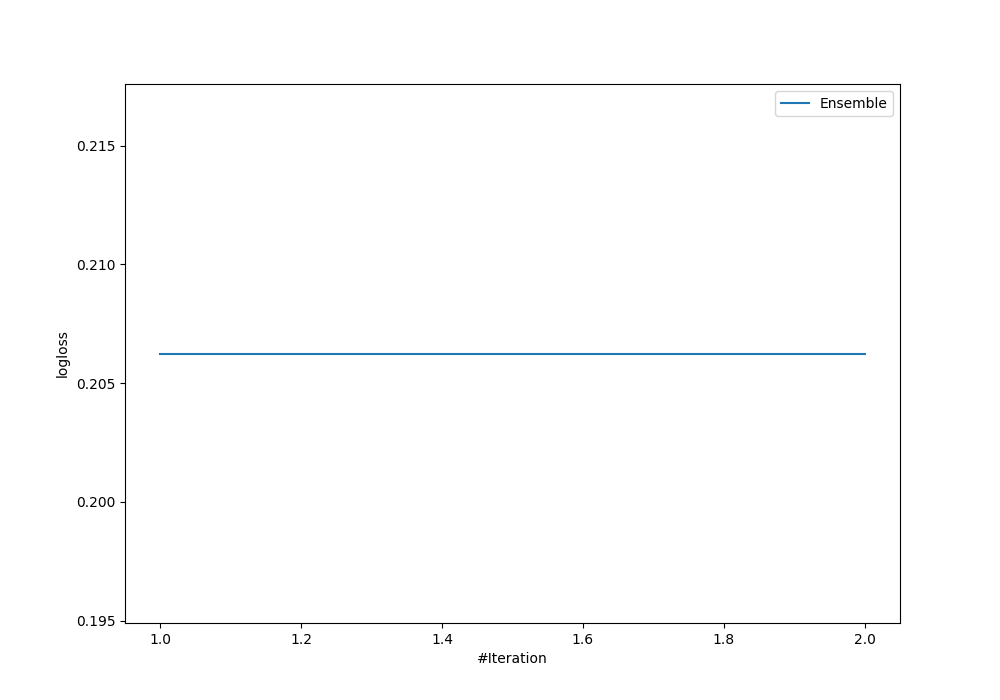
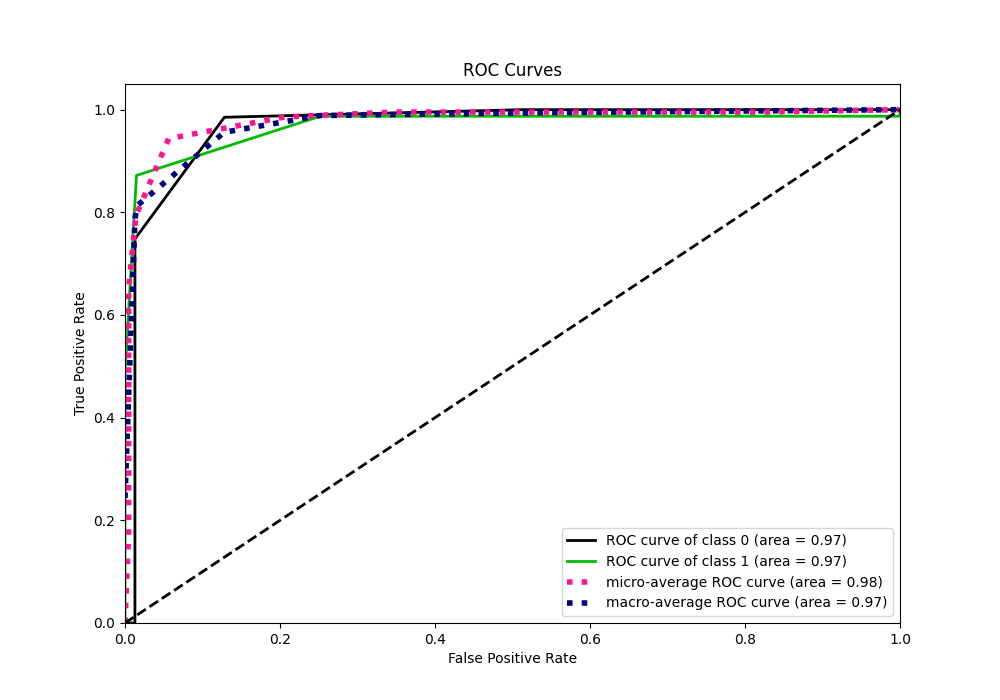
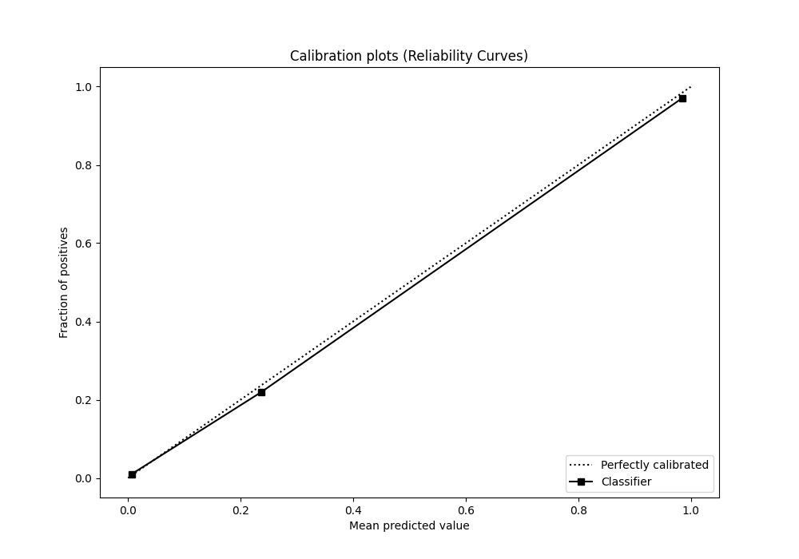

# Summary of Ensemble

[<< Go back](../README.md)

## Ensemble structure
| Model          |   Weight |
|:---------------|---------:|
| 2_DecisionTree |        1 |

## Metric details
|           |    score |   threshold |
|:----------|---------:|------------:|
| logloss   | 0.206251 |  nan        |
| auc       | 0.968946 |  nan        |
| f1        | 0.918919 |    0.487086 |
| accuracy  | 0.943662 |    0.487086 |
| precision | 0.971429 |    0.487086 |
| recall    | 0.987179 |    0        |
| mcc       | 0.878957 |    0.487086 |

## Confusion matrix (at threshold=0.487086)
|              |   Predicted as 0 |   Predicted as 1 |
|:-------------|-----------------:|-----------------:|
| Labeled as 0 |              133 |                2 |
| Labeled as 1 |               10 |               68 |

## Learning curves

## Confusion Matrix

## Normalized Confusion Matrix

## ROC Curve

## Kolmogorov-Smirnov Statistic

## Precision-Recall Curve

## Calibration Curve

## Cumulative Gains Curve

## Lift Curve

[<< Go back](../README.md)
