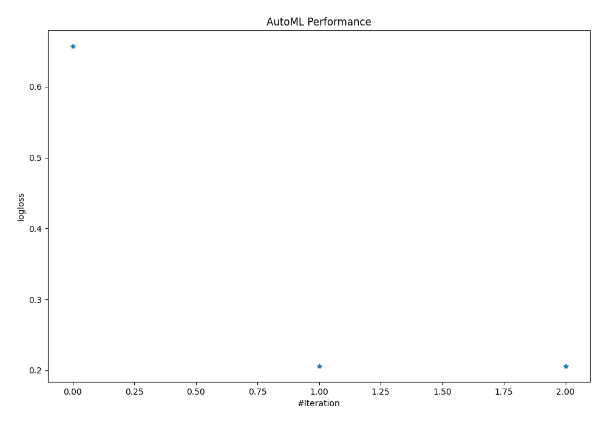
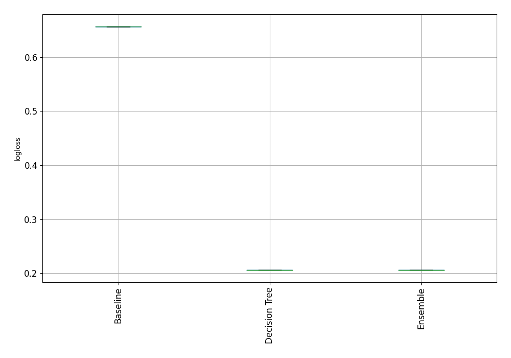
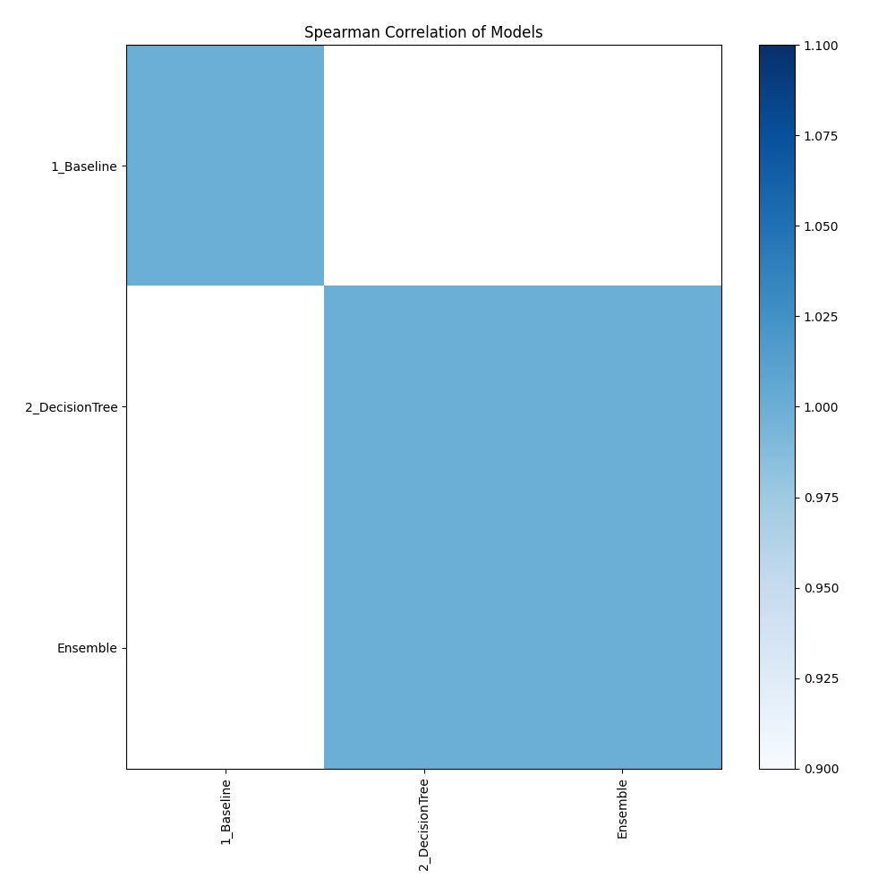

# AutoML Leaderboard

| Best model   | name                                       | model_type    | metric_type   |   metric_value |   train_time |
|:-------------|:-------------------------------------------|:--------------|:--------------|---------------:|-------------:|
|              | [1_Baseline](1_Baseline/README.md)         | Baseline      | logloss       |       0.656917 |        10.68 |
| **the best** | [2_DecisionTree](2_DecisionTree/README.md) | Decision Tree | logloss       |       0.206251 |       101.28 |
|              | [Ensemble](Ensemble/README.md)             | Ensemble      | logloss       |       0.206251 |         4.41 |

### AutoML Performance

### AutoML Performance Boxplot

### Spearman Correlation of Models

