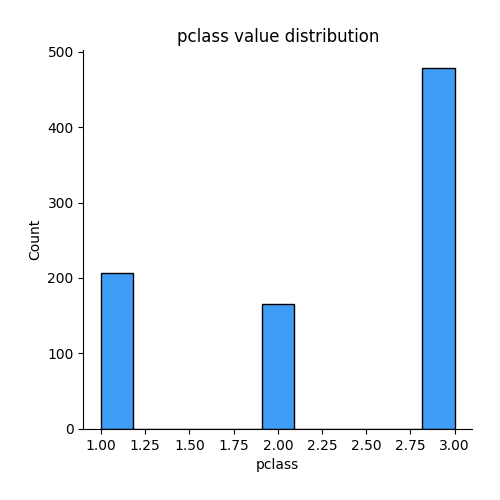
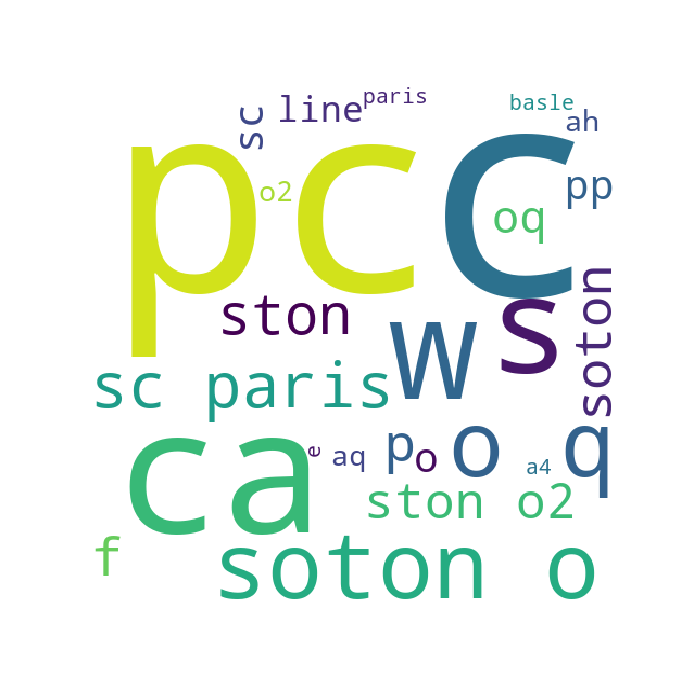

# Exploratory Data Analysis

[<< Go back](../README.md)
## Feature : target
- **Feature type** : discrete
- **Missing** : 0.0%
- **Unique** : 2
- **Count** :850.0
- **Mean** :0.36823529411764705
- **Std** :0.4826096522981839
- **Min** :0.0
- **25%th Percentile** : 0.0
- **50%th Percentile** : 0.0
- **75%th Percentile** : 1.0
- **Max** :1.0

## Feature : passenger_id
- **Feature type** : discrete
- **Missing** : 0.0%
- **Unique** : 850
- **Count** :850.0
- **Mean** :662.8164705882353
- **Std** :380.751936237571
- **Min** :1.0
- **25%th Percentile** : 332.25
- **50%th Percentile** : 676.5
- **75%th Percentile** : 992.25
- **Max** :1307.0

## Feature : pclass
- **Feature type** : discrete
- **Missing** : 0.0%
- **Unique** : 3
- **Count** :850.0
- **Mean** :2.32
- **Std** :0.8385303201209084
- **Min** :1.0
- **25%th Percentile** : 2.0
- **50%th Percentile** : 3.0
- **75%th Percentile** : 3.0
- **Max** :3.0

## Feature : name
- **Feature type** : text
- **Missing** : 0.0%
- **Unique** : 849
- **Count** :850
- **Unique** :849
- **Top** :Kelly, Mr. James
- **Freq** :2

## Feature : sex
- **Feature type** : categorical
- **Missing** : 0.0%
- **Unique** : 2
- **Count** :850
- **Unique** :2
- **Top** :male
- **Freq** :551

## Feature : age
- **Feature type** : continous
- **Missing** : 20.470588235294116%
- **Unique** : 88
- **Count** :676.0
- **Mean** :29.519847189349115
- **Std** :14.562243434125556
- **Min** :0.1667
- **25%th Percentile** : 20.0
- **50%th Percentile** : 28.0
- **75%th Percentile** : 37.0
- **Max** :80.0

## Feature : sibsp
- **Feature type** : discrete
- **Missing** : 0.0%
- **Unique** : 7
- **Count** :850.0
- **Mean** :0.5223529411764706
- **Std** :1.1121320974860462
- **Min** :0.0
- **25%th Percentile** : 0.0
- **50%th Percentile** : 0.0
- **75%th Percentile** : 1.0
- **Max** :8.0

## Feature : parch
- **Feature type** : discrete
- **Missing** : 0.0%
- **Unique** : 8
- **Count** :850.0
- **Mean** :0.38235294117647056
- **Std** :0.8795111168225364
- **Min** :0.0
- **25%th Percentile** : 0.0
- **50%th Percentile** : 0.0
- **75%th Percentile** : 0.0
- **Max** :9.0

## Feature : ticket
- **Feature type** : text
- **Missing** : 0.0%
- **Unique** : 660
- **Count** :850
- **Unique** :660
- **Top** :CA. 2343
- **Freq** :10

## Feature : fare
- **Feature type** : continous
- **Missing** : 0.11764705882352941%
- **Unique** : 236
- **Count** :849.0
- **Mean** :34.01270094228504
- **Std** :53.70577927063312
- **Min** :0.0
- **25%th Percentile** : 7.8958
- **50%th Percentile** : 14.1083
- **75%th Percentile** : 31.0
- **Max** :512.3292

## Feature : cabin
- **Feature type** : categorical
- **Missing** : 77.52941176470588%
- **Unique** : 135
- **Count** :191
- **Unique** :135
- **Top** :G6
- **Freq** :4

## Feature : embarked
- **Feature type** : categorical
- **Missing** : 0.11764705882352941%
- **Unique** : 3
- **Count** :849
- **Unique** :3
- **Top** :S
- **Freq** :589

## Feature : boat
- **Feature type** : categorical
- **Missing** : 63.76470588235294%
- **Unique** : 26
- **Count** :308
- **Unique** :26
- **Top** :4
- **Freq** :25

## Feature : body
- **Feature type** : continous
- **Missing** : 91.41176470588235%
- **Unique** : 73
- **Count** :73.0
- **Mean** :165.82191780821918
- **Std** :99.06848675786439
- **Min** :4.0
- **25%th Percentile** : 75.0
- **50%th Percentile** : 166.0
- **75%th Percentile** : 260.0
- **Max** :328.0

## Feature : home.dest
- **Feature type** : categorical
- **Missing** : 45.411764705882355%
- **Unique** : 272
- **Count** :464
- **Unique** :272
- **Top** :New York, NY
- **Freq** :36

[<< Go back](../README.md)
