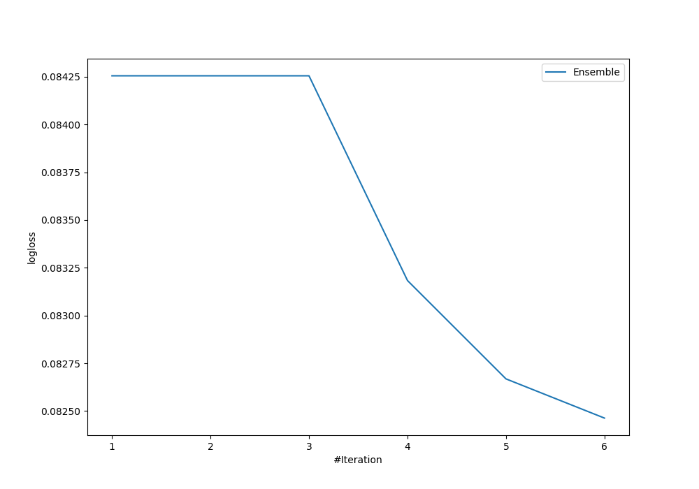
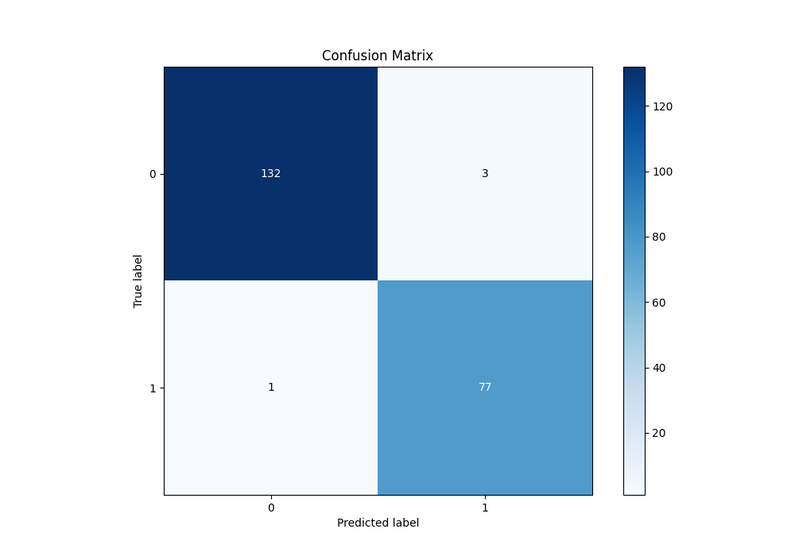
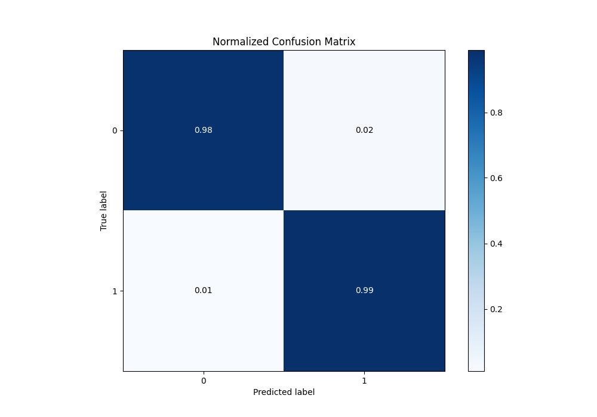
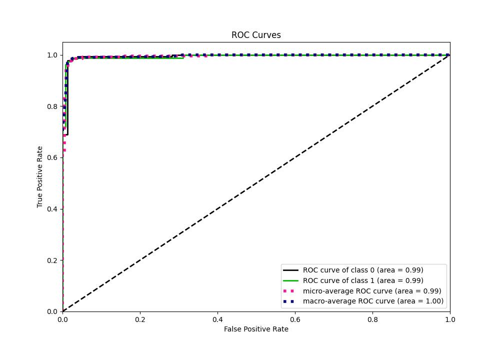
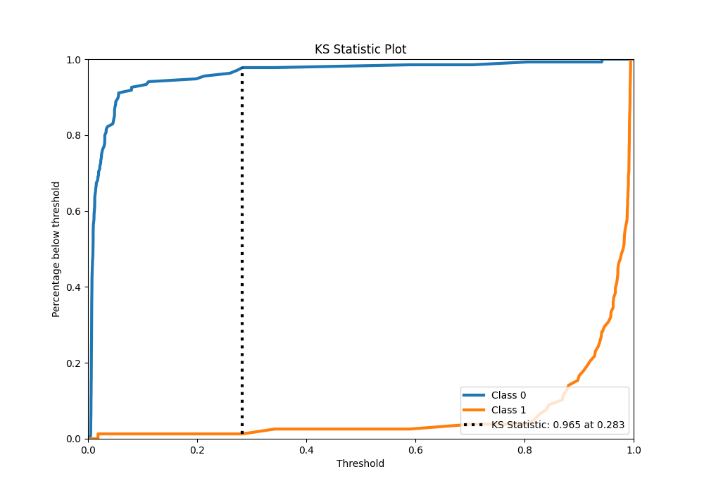
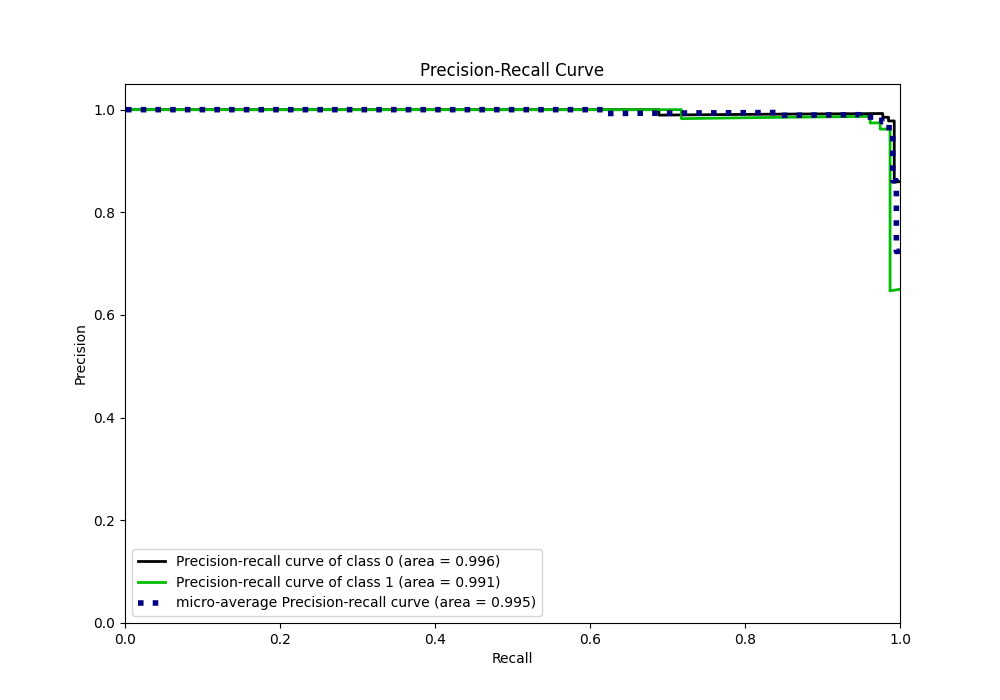
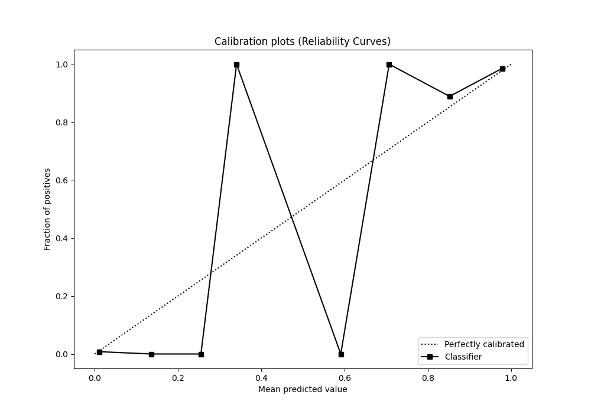
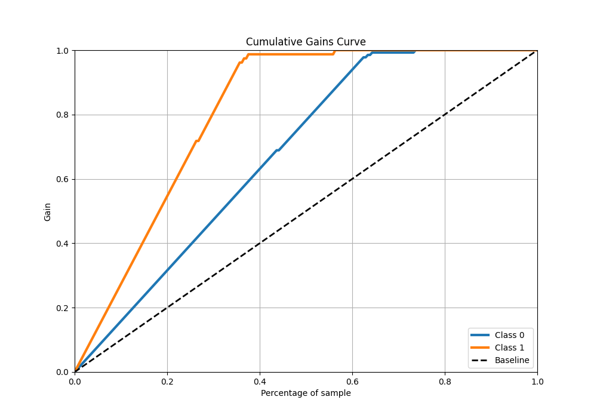
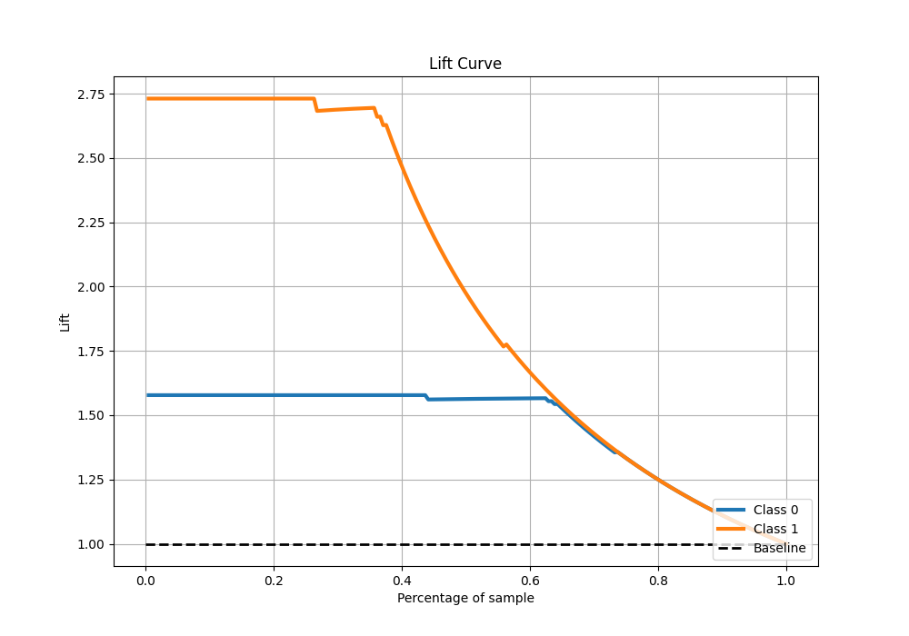

# Summary of Ensemble

[<< Go back](../README.md)

## Ensemble structure
| Model                  |   Weight |
|:-----------------------|---------:|
| 4_Default_Xgboost      |        5 |
| 6_Default_RandomForest |        1 |

## Metric details
|           |     score |    threshold |
|:----------|----------:|-------------:|
| logloss   | 0.0824633 | nan          |
| auc       | 0.993732  | nan          |
| f1        | 0.974684  |   0.297418   |
| accuracy  | 0.981221  |   0.297418   |
| precision | 1         |   0.978079   |
| recall    | 1         |   0.00431809 |
| mcc       | 0.959956  |   0.297418   |

## Confusion matrix (at threshold=0.297418)
|              |   Predicted as 0 |   Predicted as 1 |
|:-------------|-----------------:|-----------------:|
| Labeled as 0 |              132 |                3 |
| Labeled as 1 |                1 |               77 |

## Learning curves

## Confusion Matrix

## Normalized Confusion Matrix

## ROC Curve

## Kolmogorov-Smirnov Statistic

## Precision-Recall Curve

## Calibration Curve

## Cumulative Gains Curve

## Lift Curve

[<< Go back](../README.md)
