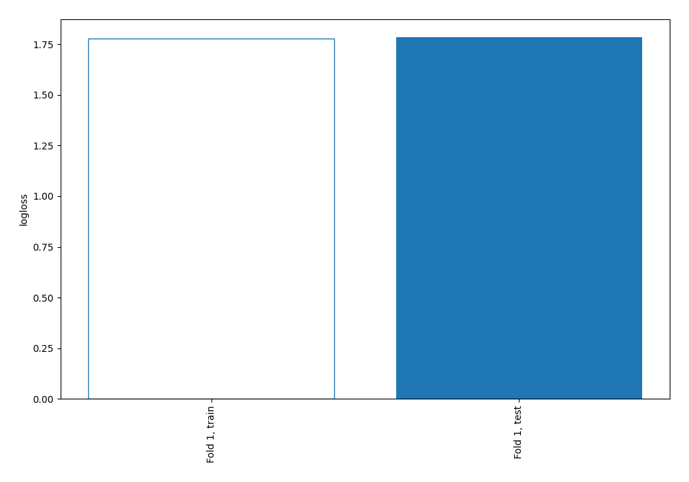
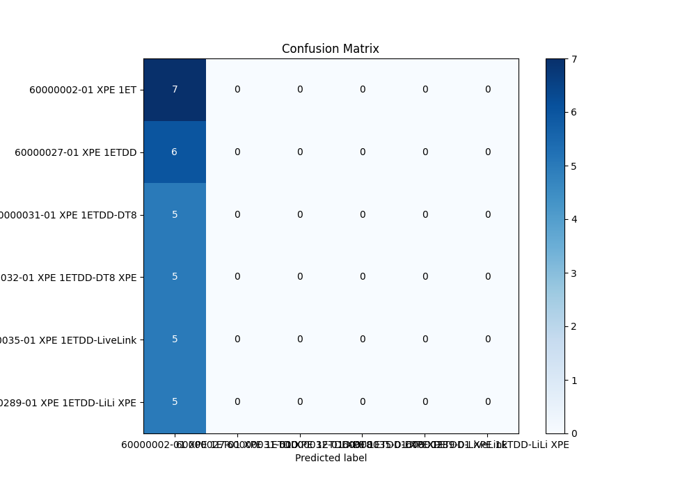
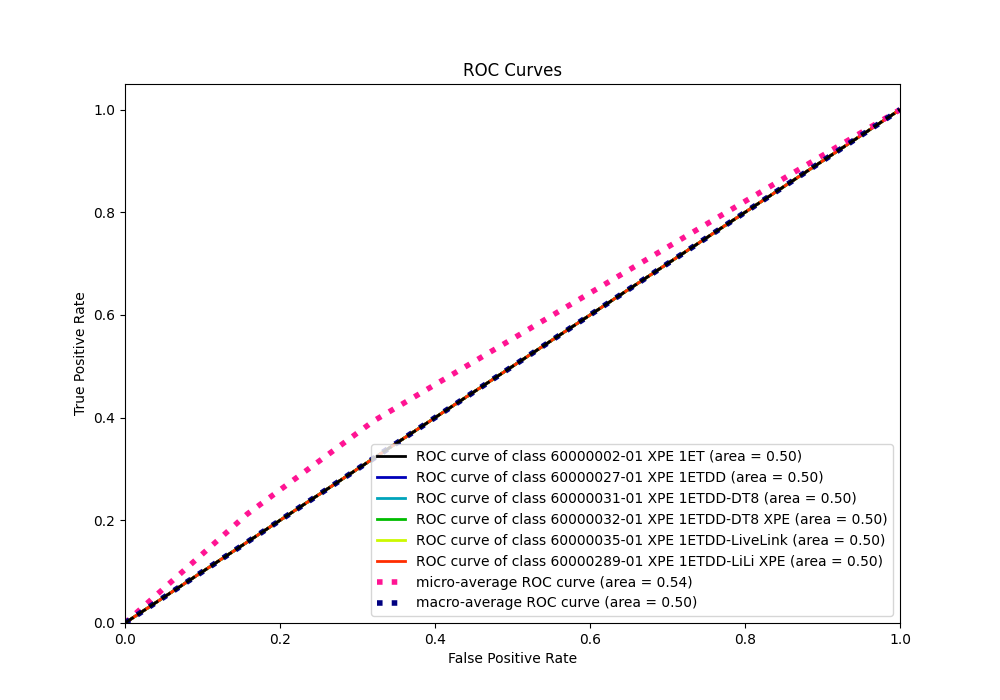
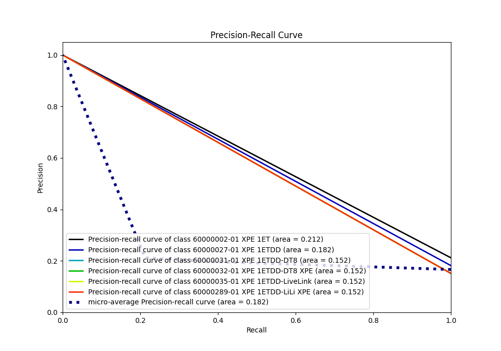

# Summary of 1_Baseline

[<< Go back](../README.md)

## Baseline Classifier (Baseline)
- **n_jobs**: -1
- **num_class**: 6
- **explain_level**: 2

## Validation
 - **validation_type**: split
 - **train_ratio**: 0.75
 - **shuffle**: True
 - **stratify**: True

## Optimized metric
logloss

## Training time

1.1 seconds

### Metric details
|           |   60000002-01 XPE 1ET |   60000027-01 XPE 1ETDD |   60000031-01 XPE 1ETDD-DT8 |   60000032-01 XPE 1ETDD-DT8 XPE |   60000035-01 XPE 1ETDD-LiveLink |   60000289-01 XPE 1ETDD-LiLi XPE |   accuracy |   macro avg |   weighted avg |   logloss |
|:----------|----------------------:|------------------------:|----------------------------:|--------------------------------:|---------------------------------:|---------------------------------:|-----------:|------------:|---------------:|----------:|
| precision |              0.212121 |                       0 |                           0 |                               0 |                                0 |                                0 |   0.212121 |   0.0353535 |      0.0449954 |   1.78467 |
| recall    |              1        |                       0 |                           0 |                               0 |                                0 |                                0 |   0.212121 |   0.166667  |      0.212121  |   1.78467 |
| f1-score  |              0.35     |                       0 |                           0 |                               0 |                                0 |                                0 |   0.212121 |   0.0583333 |      0.0742424 |   1.78467 |
| support   |              7        |                       6 |                           5 |                               5 |                                5 |                                5 |   0.212121 |  33         |     33         |   1.78467 |

## Confusion matrix
|                                           |   Predicted as 60000002-01 XPE 1ET |   Predicted as 60000027-01 XPE 1ETDD |   Predicted as 60000031-01 XPE 1ETDD-DT8 |   Predicted as 60000032-01 XPE 1ETDD-DT8 XPE |   Predicted as 60000035-01 XPE 1ETDD-LiveLink |   Predicted as 60000289-01 XPE 1ETDD-LiLi XPE |
|:------------------------------------------|-----------------------------------:|-------------------------------------:|-----------------------------------------:|---------------------------------------------:|----------------------------------------------:|----------------------------------------------:|
| Labeled as 60000002-01 XPE 1ET            |                                  7 |                                    0 |                                        0 |                                            0 |                                             0 |                                             0 |
| Labeled as 60000027-01 XPE 1ETDD          |                                  6 |                                    0 |                                        0 |                                            0 |                                             0 |                                             0 |
| Labeled as 60000031-01 XPE 1ETDD-DT8      |                                  5 |                                    0 |                                        0 |                                            0 |                                             0 |                                             0 |
| Labeled as 60000032-01 XPE 1ETDD-DT8 XPE  |                                  5 |                                    0 |                                        0 |                                            0 |                                             0 |                                             0 |
| Labeled as 60000035-01 XPE 1ETDD-LiveLink |                                  5 |                                    0 |                                        0 |                                            0 |                                             0 |                                             0 |
| Labeled as 60000289-01 XPE 1ETDD-LiLi XPE |                                  5 |                                    0 |                                        0 |                                            0 |                                             0 |                                             0 |

## Learning curves

## Confusion Matrix

## Normalized Confusion Matrix

## ROC Curve

## Precision Recall Curve

[<< Go back](../README.md)
