# Summary of 3_Linear

[<< Go back](../README.md)

## Logistic Regression (Linear)
- **n_jobs**: -1
- **num_class**: 6
- **explain_level**: 2

## Validation
 - **validation_type**: split
 - **train_ratio**: 0.75
 - **shuffle**: True
 - **stratify**: True

## Optimized metric
logloss

## Training time

12.5 seconds

### Metric details
|           |   60000002-01 XPE 1ET |   60000027-01 XPE 1ETDD |   60000031-01 XPE 1ETDD-DT8 |   60000032-01 XPE 1ETDD-DT8 XPE |   60000035-01 XPE 1ETDD-LiveLink |   60000289-01 XPE 1ETDD-LiLi XPE |   accuracy |   macro avg |   weighted avg |   logloss |
|:----------|----------------------:|------------------------:|----------------------------:|--------------------------------:|---------------------------------:|---------------------------------:|-----------:|------------:|---------------:|----------:|
| precision |                     1 |                       0 |                    0.666667 |                        0.833333 |                             1    |                         0.454545 |   0.727273 |    0.659091 |       0.65978  |  0.813505 |
| recall    |                     1 |                       0 |                    0.8      |                        1        |                             0.6  |                         1        |   0.727273 |    0.733333 |       0.727273 |  0.813505 |
| f1-score  |                     1 |                       0 |                    0.727273 |                        0.909091 |                             0.75 |                         0.625    |   0.727273 |    0.668561 |       0.668388 |  0.813505 |
| support   |                     7 |                       6 |                    5        |                        5        |                             5    |                         5        |   0.727273 |   33        |      33        |  0.813505 |

## Confusion matrix
|                                           |   Predicted as 60000002-01 XPE 1ET |   Predicted as 60000027-01 XPE 1ETDD |   Predicted as 60000031-01 XPE 1ETDD-DT8 |   Predicted as 60000032-01 XPE 1ETDD-DT8 XPE |   Predicted as 60000035-01 XPE 1ETDD-LiveLink |   Predicted as 60000289-01 XPE 1ETDD-LiLi XPE |
|:------------------------------------------|-----------------------------------:|-------------------------------------:|-----------------------------------------:|---------------------------------------------:|----------------------------------------------:|----------------------------------------------:|
| Labeled as 60000002-01 XPE 1ET            |                                  7 |                                    0 |                                        0 |                                            0 |                                             0 |                                             0 |
| Labeled as 60000027-01 XPE 1ETDD          |                                  0 |                                    0 |                                        2 |                                            0 |                                             0 |                                             4 |
| Labeled as 60000031-01 XPE 1ETDD-DT8      |                                  0 |                                    0 |                                        4 |                                            1 |                                             0 |                                             0 |
| Labeled as 60000032-01 XPE 1ETDD-DT8 XPE  |                                  0 |                                    0 |                                        0 |                                            5 |                                             0 |                                             0 |
| Labeled as 60000035-01 XPE 1ETDD-LiveLink |                                  0 |                                    0 |                                        0 |                                            0 |                                             3 |                                             2 |
| Labeled as 60000289-01 XPE 1ETDD-LiLi XPE |                                  0 |                                    0 |                                        0 |                                            0 |                                             0 |                                             5 |

## Learning curves
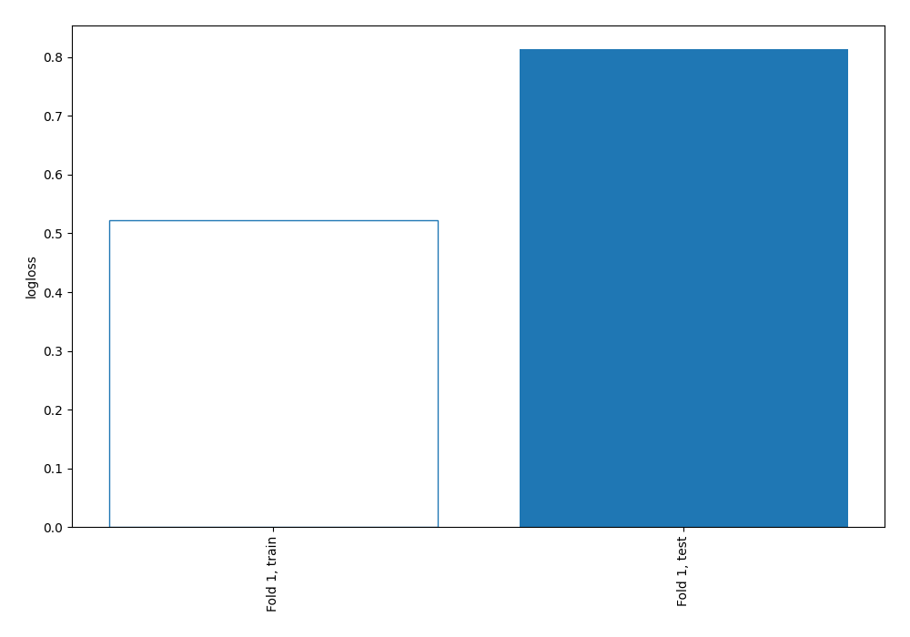

## Coefficients

### Coefficients learner #1
|                  |   60000002-01 XPE 1ET |   60000027-01 XPE 1ETDD |   60000031-01 XPE 1ETDD-DT8 |   60000032-01 XPE 1ETDD-DT8 XPE |   60000035-01 XPE 1ETDD-LiveLink |   60000289-01 XPE 1ETDD-LiLi XPE |
|:-----------------|----------------------:|------------------------:|----------------------------:|--------------------------------:|---------------------------------:|---------------------------------:|
| intercept        |          -0.490956    |              0.930684   |                   0.0742873 |                     -1.43288    |                       0.570503   |                        0.348359  |
| Objekt           |          -0.000173029 |             -0.00883276 |                   0.257688  |                     -0.224349   |                      -0.00515302 |                       -0.0191807 |
| Bezeichnung      |          -0.355241    |             -0.398852   |                   0.492733  |                      1.18302    |                      -1.17929    |                        0.257624  |
| Z_P_BAUREIHE_NEU |           0.267662    |              0.0905231  |                   1.13022   |                     -0.517033   |                      -0.00108404 |                       -0.970287  |
| Z_P_FUNKTION     |          -0.0631067   |              0.409857   |                  -0.0314867 |                     -0.0155349  |                      -0.115912   |                       -0.183816  |
| Z_P_SCHALTUNG    |          -3.07646     |              0.309601   |                   1.46598   |                      0.379204   |                       0.532269   |                        0.389401  |
| Z_P_LEDSYSTEM_1  |          -0.00453178  |             -0.288507   |                   0.280541  |                      0.635674   |                      -0.181749   |                       -0.441427  |
| Z_P_LEDSYSTEM_2  |           0.00453178  |              0.288507   |                  -0.280541  |                     -0.635674   |                       0.181749   |                        0.441427  |
| Z_P_LEDSYSTEM_3  |           0.00453178  |              0.288507   |                  -0.280541  |                     -0.635674   |                       0.181749   |                        0.441427  |
| Z_P_LMS          |           0.166609    |              0.302007   |                   0.189618  |                      0.00127158 |                      -0.716148   |                        0.0566421 |
| Z_P_SCHUTZKLASSE |          -0.0631067   |              0.409857   |                  -0.0314867 |                     -0.0155349  |                      -0.115912   |                       -0.183816  |

## Permutation-based Importance
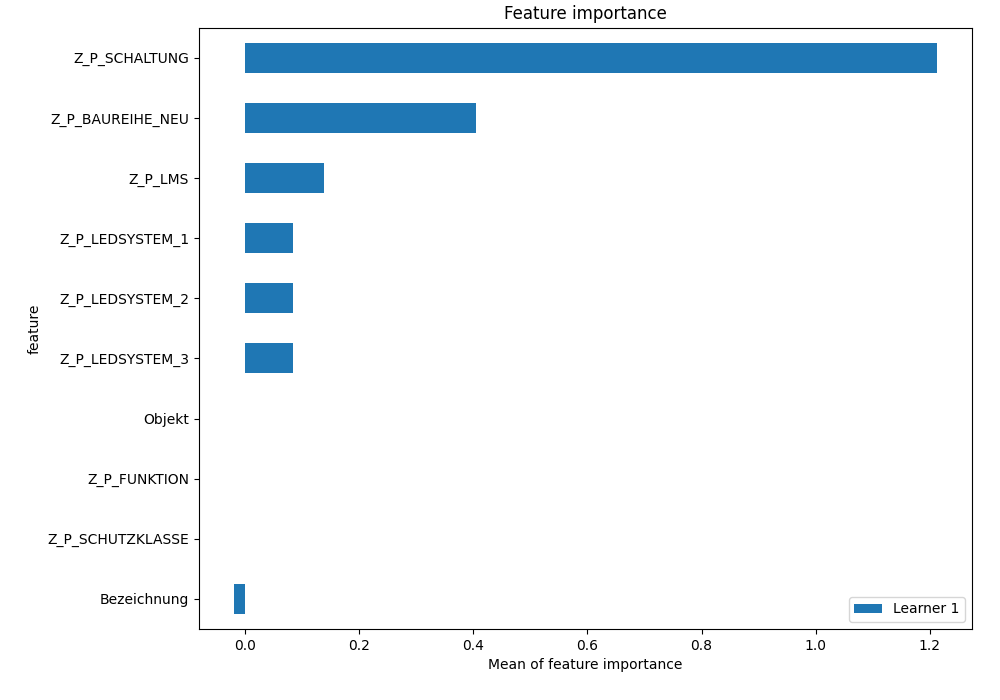
## Confusion Matrix

## Normalized Confusion Matrix

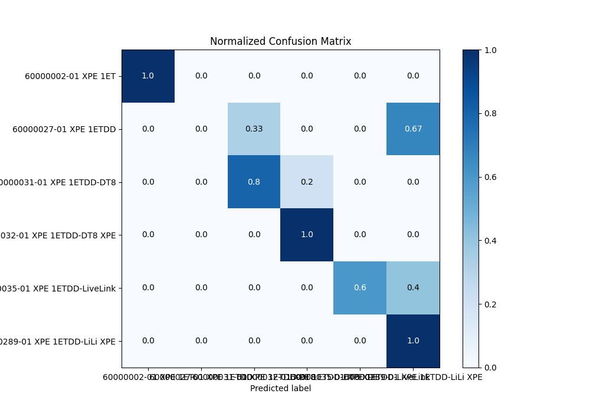

## ROC Curve

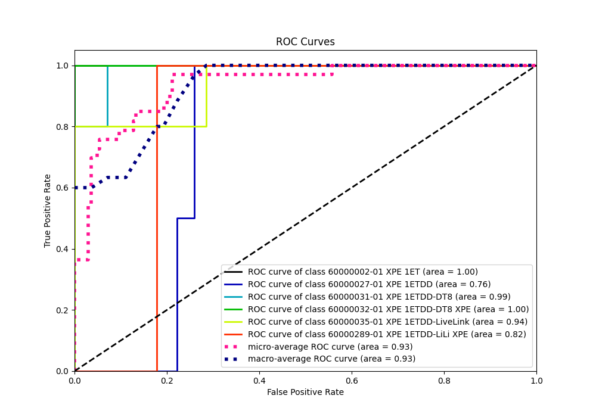

## Precision Recall Curve

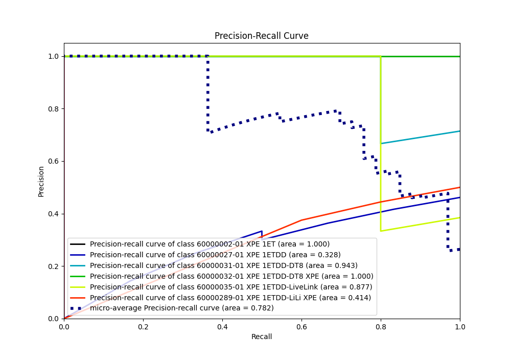

## SHAP Importance
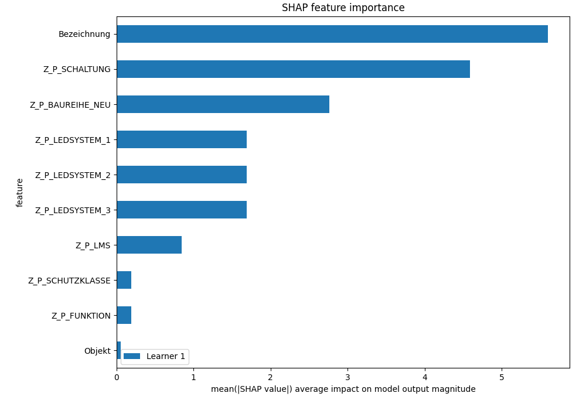

## SHAP Dependence plots

### Dependence 60000002-01 XPE 1ET (Fold 1)
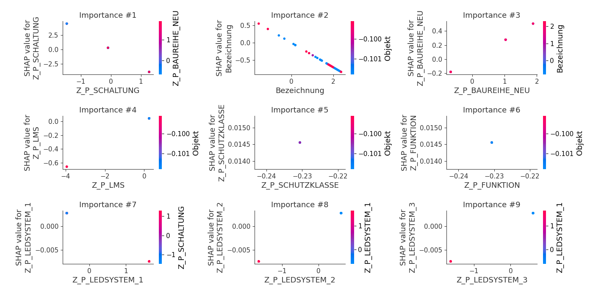
### Dependence 60000027-01 XPE 1ETDD (Fold 1)
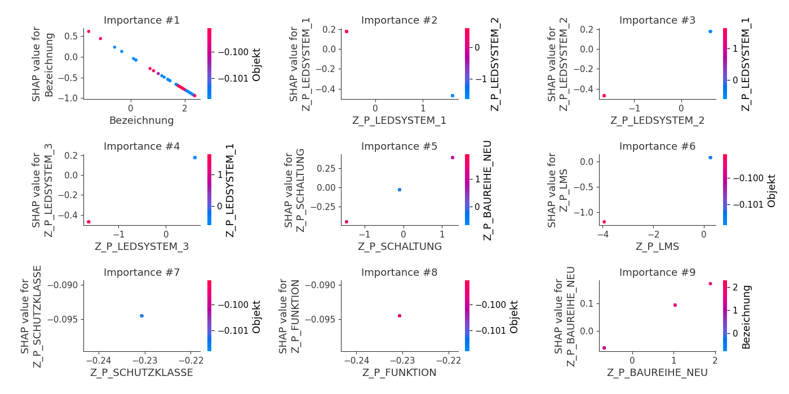
### Dependence 60000031-01 XPE 1ETDD-DT8 (Fold 1)

### Dependence 60000032-01 XPE 1ETDD-DT8 XPE (Fold 1)

### Dependence 60000035-01 XPE 1ETDD-LiveLink (Fold 1)
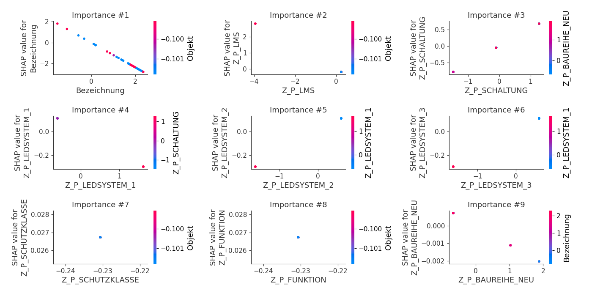
### Dependence 60000289-01 XPE 1ETDD-LiLi XPE (Fold 1)
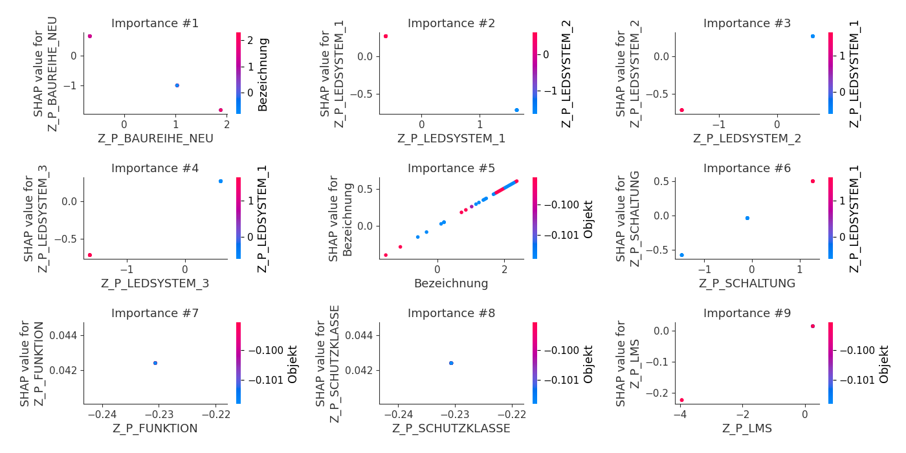

## SHAP Decision plots

### Worst decisions for selected sample 1 (Fold 1)
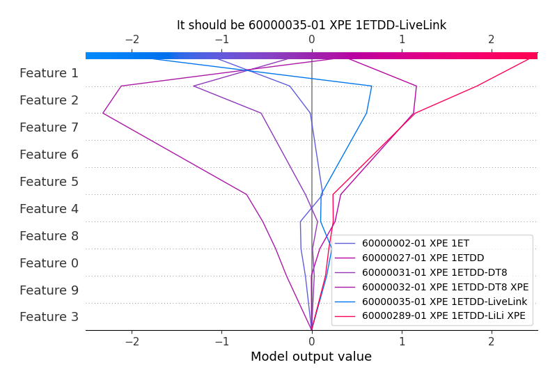
### Worst decisions for selected sample 2 (Fold 1)

### Worst decisions for selected sample 3 (Fold 1)

### Worst decisions for selected sample 4 (Fold 1)
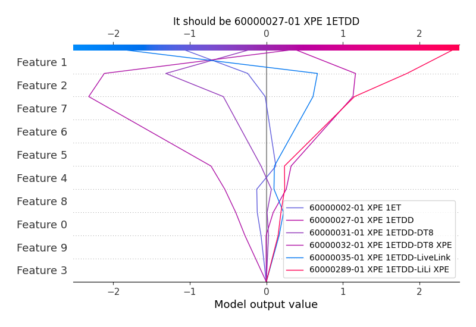
### Best decisions for selected sample 1 (Fold 1)

### Best decisions for selected sample 2 (Fold 1)
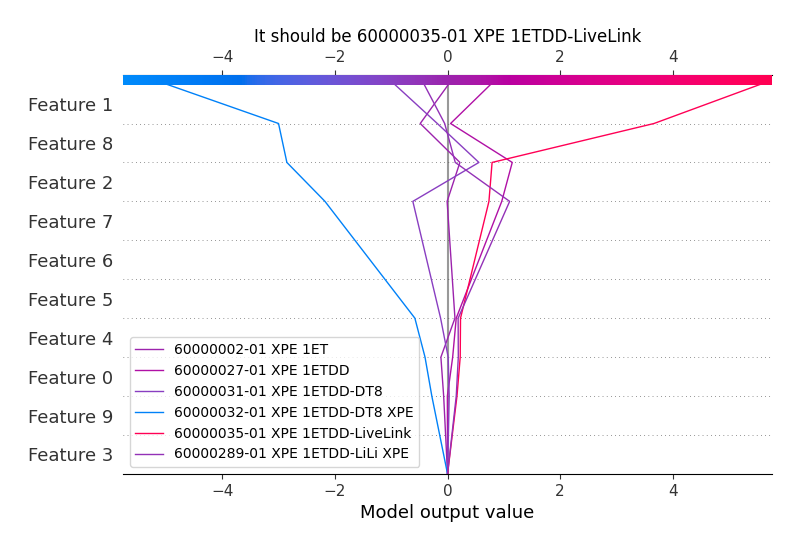
### Best decisions for selected sample 3 (Fold 1)

### Best decisions for selected sample 4 (Fold 1)
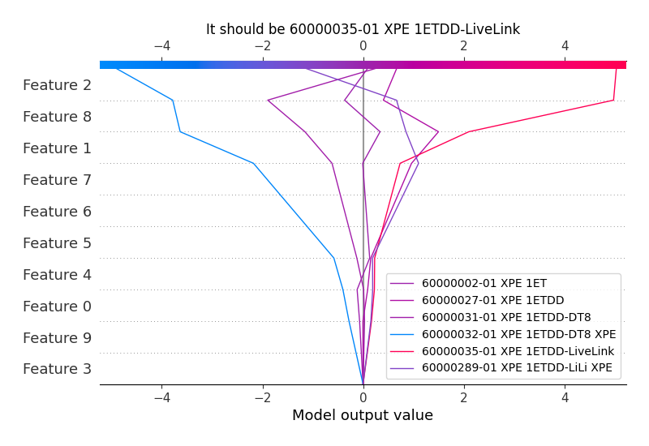

[<< Go back](../README.md)
