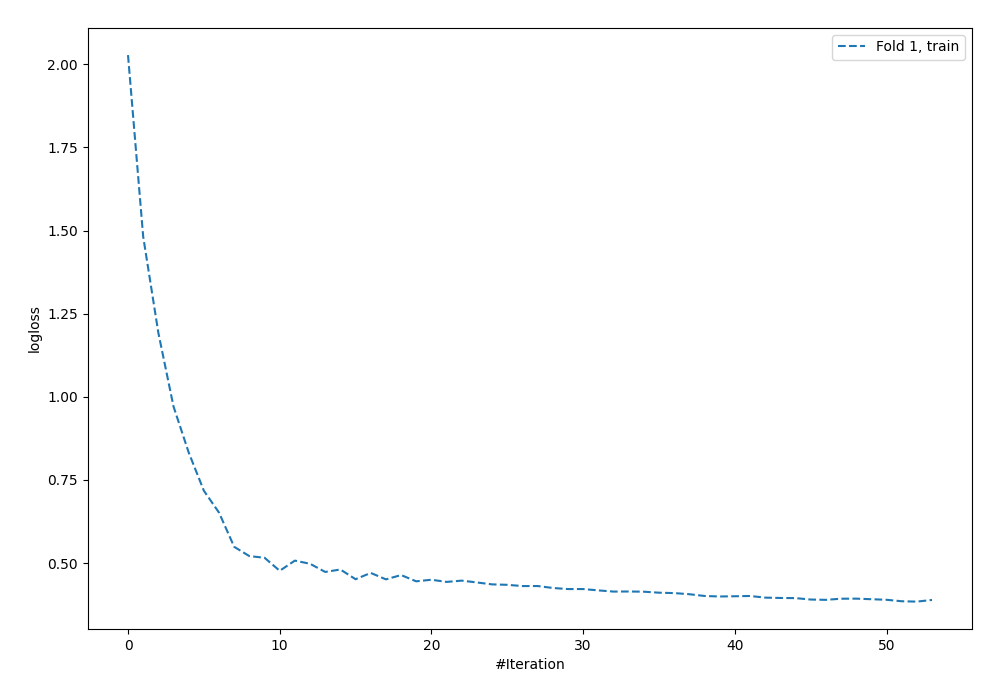
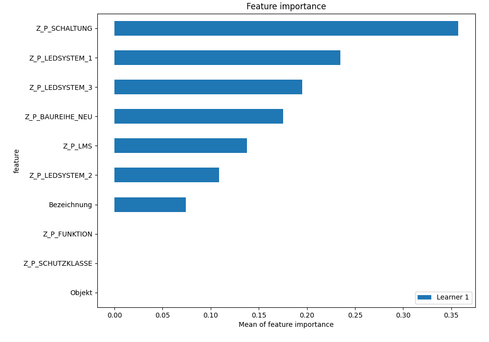
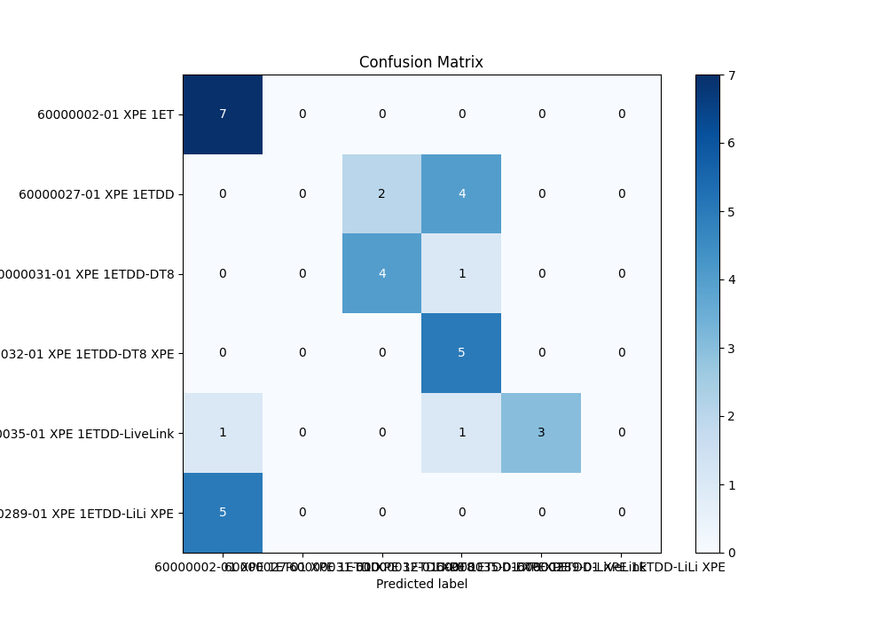
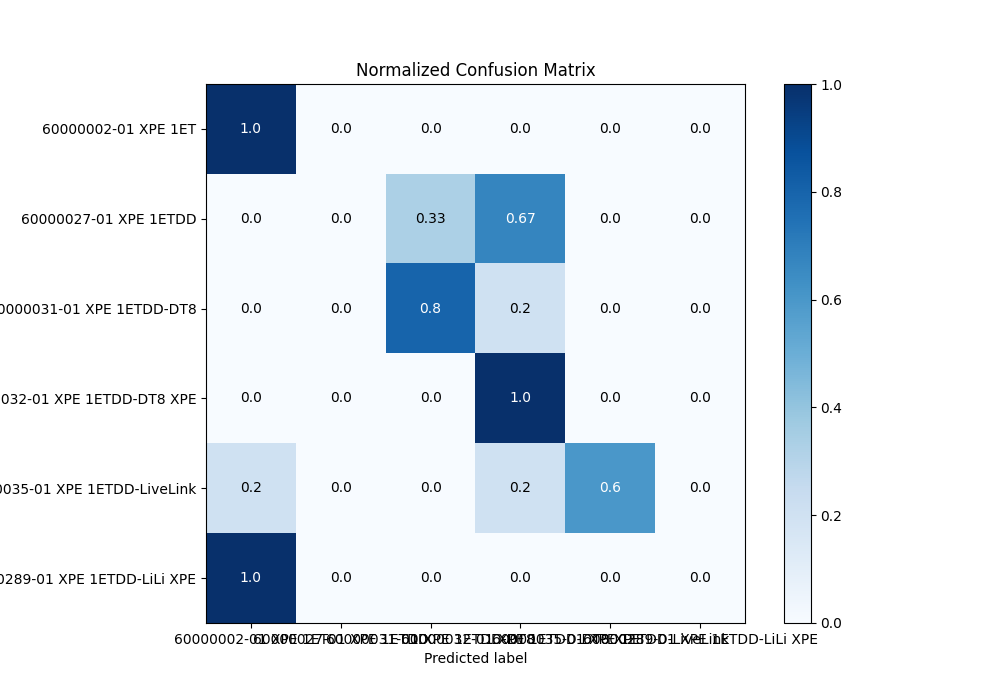
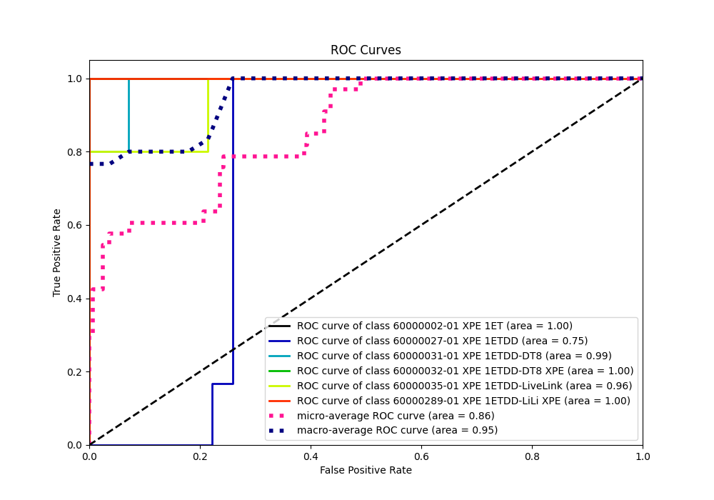
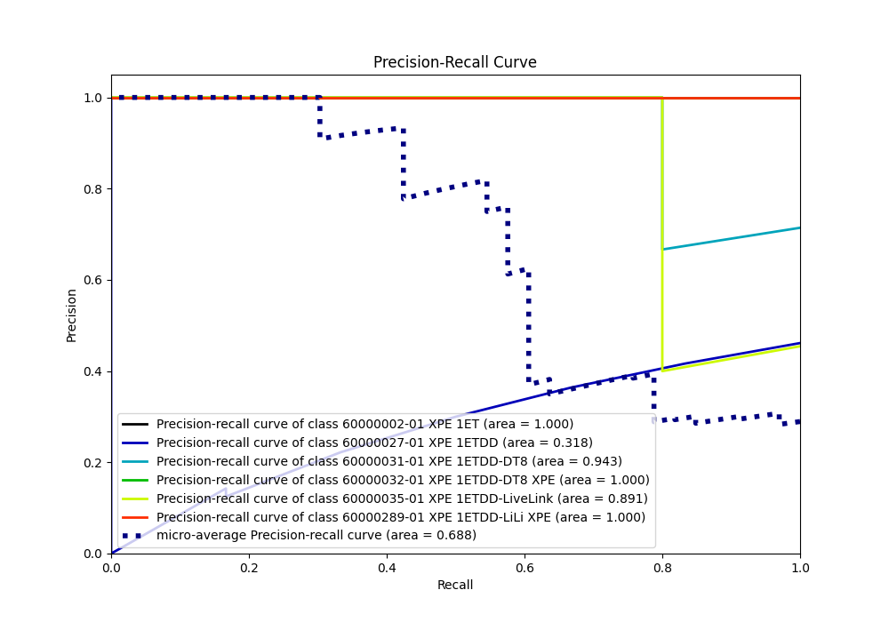

# Summary of 5_Default_NeuralNetwork

[<< Go back](../README.md)

## Neural Network
- **n_jobs**: -1
- **dense_1_size**: 32
- **dense_2_size**: 16
- **learning_rate**: 0.05
- **num_class**: 6
- **explain_level**: 2

## Validation
 - **validation_type**: split
 - **train_ratio**: 0.75
 - **shuffle**: True
 - **stratify**: True

## Optimized metric
logloss

## Training time

1.8 seconds

### Metric details
|           |   60000002-01 XPE 1ET |   60000027-01 XPE 1ETDD |   60000031-01 XPE 1ETDD-DT8 |   60000032-01 XPE 1ETDD-DT8 XPE |   60000035-01 XPE 1ETDD-LiveLink |   60000289-01 XPE 1ETDD-LiLi XPE |   accuracy |   macro avg |   weighted avg |   logloss |
|:----------|----------------------:|------------------------:|----------------------------:|--------------------------------:|---------------------------------:|---------------------------------:|-----------:|------------:|---------------:|----------:|
| precision |              0.538462 |                       0 |                    0.666667 |                        0.454545 |                             1    |                                0 |   0.575758 |    0.443279 |       0.435615 |   1.15848 |
| recall    |              1        |                       0 |                    0.8      |                        1        |                             0.6  |                                0 |   0.575758 |    0.566667 |       0.575758 |   1.15848 |
| f1-score  |              0.7      |                       0 |                    0.727273 |                        0.625    |                             0.75 |                                0 |   0.575758 |    0.467045 |       0.467011 |   1.15848 |
| support   |              7        |                       6 |                    5        |                        5        |                             5    |                                5 |   0.575758 |   33        |      33        |   1.15848 |

## Confusion matrix
|                                           |   Predicted as 60000002-01 XPE 1ET |   Predicted as 60000027-01 XPE 1ETDD |   Predicted as 60000031-01 XPE 1ETDD-DT8 |   Predicted as 60000032-01 XPE 1ETDD-DT8 XPE |   Predicted as 60000035-01 XPE 1ETDD-LiveLink |   Predicted as 60000289-01 XPE 1ETDD-LiLi XPE |
|:------------------------------------------|-----------------------------------:|-------------------------------------:|-----------------------------------------:|---------------------------------------------:|----------------------------------------------:|----------------------------------------------:|
| Labeled as 60000002-01 XPE 1ET            |                                  7 |                                    0 |                                        0 |                                            0 |                                             0 |                                             0 |
| Labeled as 60000027-01 XPE 1ETDD          |                                  0 |                                    0 |                                        2 |                                            4 |                                             0 |                                             0 |
| Labeled as 60000031-01 XPE 1ETDD-DT8      |                                  0 |                                    0 |                                        4 |                                            1 |                                             0 |                                             0 |
| Labeled as 60000032-01 XPE 1ETDD-DT8 XPE  |                                  0 |                                    0 |                                        0 |                                            5 |                                             0 |                                             0 |
| Labeled as 60000035-01 XPE 1ETDD-LiveLink |                                  1 |                                    0 |                                        0 |                                            1 |                                             3 |                                             0 |
| Labeled as 60000289-01 XPE 1ETDD-LiLi XPE |                                  5 |                                    0 |                                        0 |                                            0 |                                             0 |                                             0 |

## Learning curves

## Permutation-based Importance

## Confusion Matrix

## Normalized Confusion Matrix

## ROC Curve

## Precision Recall Curve

[<< Go back](../README.md)
