# Summary of 6_Default_RandomForest

[<< Go back](../README.md)

## Random Forest
- **n_jobs**: -1
- **criterion**: gini
- **max_features**: 0.9
- **min_samples_split**: 30
- **max_depth**: 4
- **eval_metric_name**: logloss
- **num_class**: 6
- **explain_level**: 2

## Validation
 - **validation_type**: split
 - **train_ratio**: 0.75
 - **shuffle**: True
 - **stratify**: True

## Optimized metric
logloss

## Training time

14.4 seconds

### Metric details
|           |   60000002-01 XPE 1ET |   60000027-01 XPE 1ETDD |   60000031-01 XPE 1ETDD-DT8 |   60000032-01 XPE 1ETDD-DT8 XPE |   60000035-01 XPE 1ETDD-LiveLink |   60000289-01 XPE 1ETDD-LiLi XPE |   accuracy |   macro avg |   weighted avg |   logloss |
|:----------|----------------------:|------------------------:|----------------------------:|--------------------------------:|---------------------------------:|---------------------------------:|-----------:|------------:|---------------:|----------:|
| precision |                     1 |                       0 |                        1    |                        0.333333 |                             1    |                                1 |    0.69697 |    0.722222 |       0.717172 |   0.88504 |
| recall    |                     1 |                       0 |                        0.6  |                        1        |                             0.6  |                                1 |    0.69697 |    0.7      |       0.69697  |   0.88504 |
| f1-score  |                     1 |                       0 |                        0.75 |                        0.5      |                             0.75 |                                1 |    0.69697 |    0.666667 |       0.666667 |   0.88504 |
| support   |                     7 |                       6 |                        5    |                        5        |                             5    |                                5 |    0.69697 |   33        |      33        |   0.88504 |

## Confusion matrix
|                                           |   Predicted as 60000002-01 XPE 1ET |   Predicted as 60000027-01 XPE 1ETDD |   Predicted as 60000031-01 XPE 1ETDD-DT8 |   Predicted as 60000032-01 XPE 1ETDD-DT8 XPE |   Predicted as 60000035-01 XPE 1ETDD-LiveLink |   Predicted as 60000289-01 XPE 1ETDD-LiLi XPE |
|:------------------------------------------|-----------------------------------:|-------------------------------------:|-----------------------------------------:|---------------------------------------------:|----------------------------------------------:|----------------------------------------------:|
| Labeled as 60000002-01 XPE 1ET            |                                  7 |                                    0 |                                        0 |                                            0 |                                             0 |                                             0 |
| Labeled as 60000027-01 XPE 1ETDD          |                                  0 |                                    0 |                                        0 |                                            6 |                                             0 |                                             0 |
| Labeled as 60000031-01 XPE 1ETDD-DT8      |                                  0 |                                    0 |                                        3 |                                            2 |                                             0 |                                             0 |
| Labeled as 60000032-01 XPE 1ETDD-DT8 XPE  |                                  0 |                                    0 |                                        0 |                                            5 |                                             0 |                                             0 |
| Labeled as 60000035-01 XPE 1ETDD-LiveLink |                                  0 |                                    0 |                                        0 |                                            2 |                                             3 |                                             0 |
| Labeled as 60000289-01 XPE 1ETDD-LiLi XPE |                                  0 |                                    0 |                                        0 |                                            0 |                                             0 |                                             5 |

## Learning curves
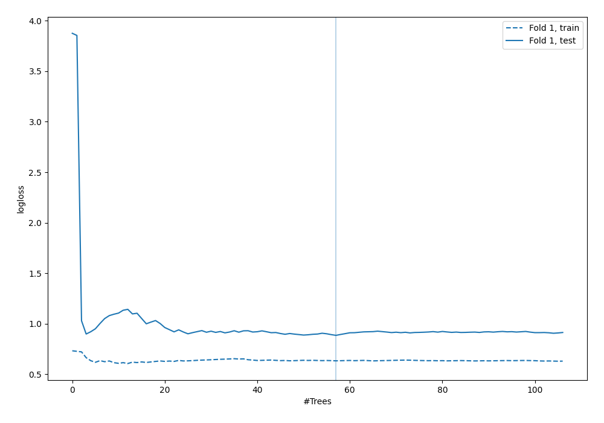

## Permutation-based Importance
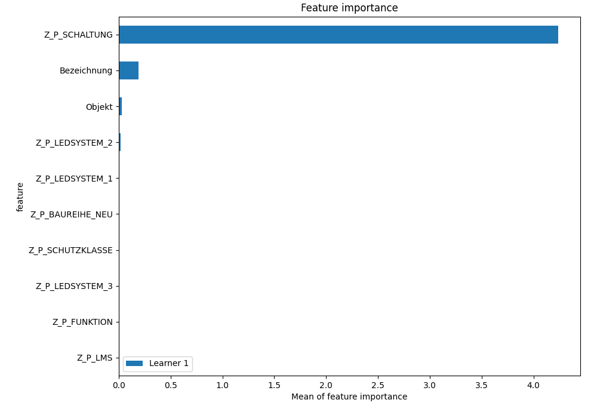
## Confusion Matrix

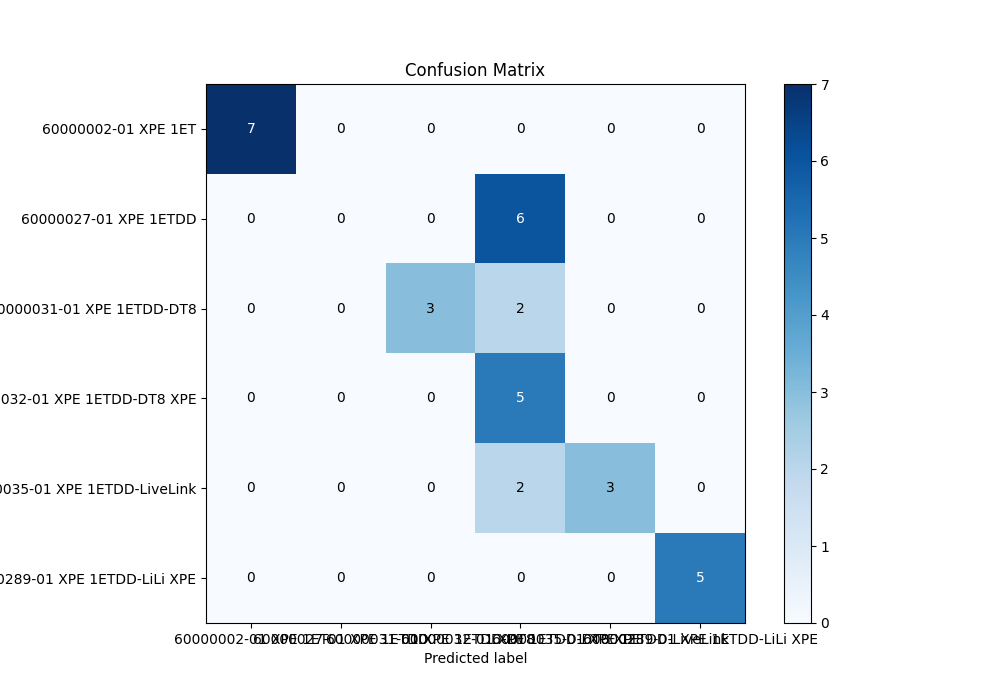

## Normalized Confusion Matrix

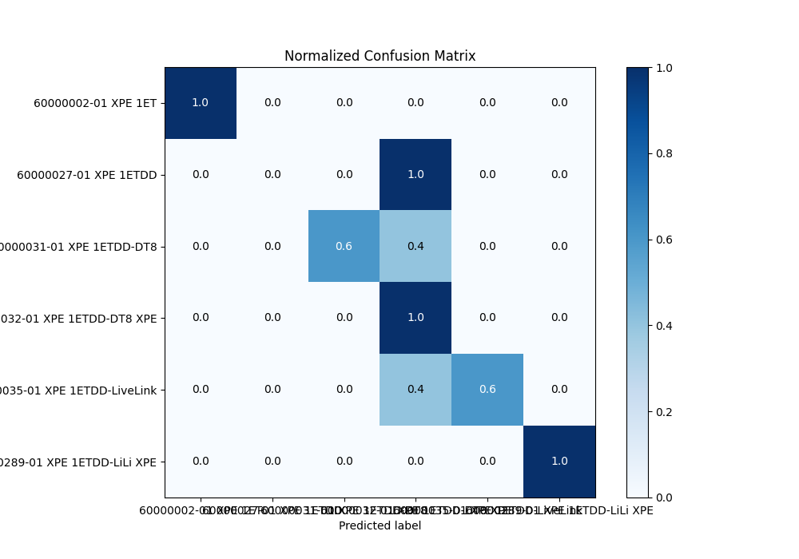

## ROC Curve

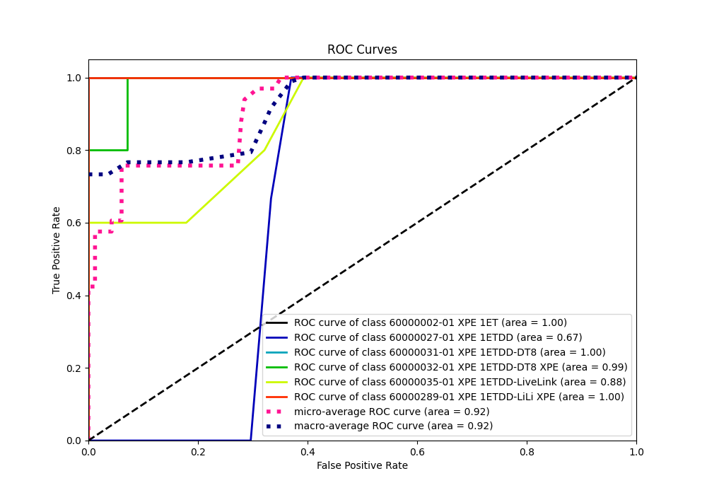

## Precision Recall Curve

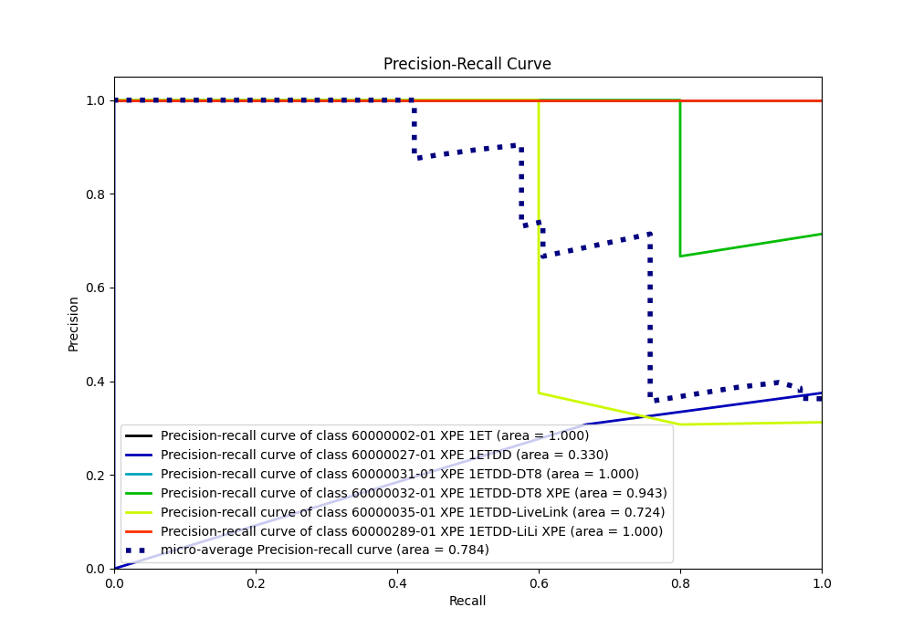

## SHAP Importance

## SHAP Dependence plots

### Dependence 60000002-01 XPE 1ET (Fold 1)
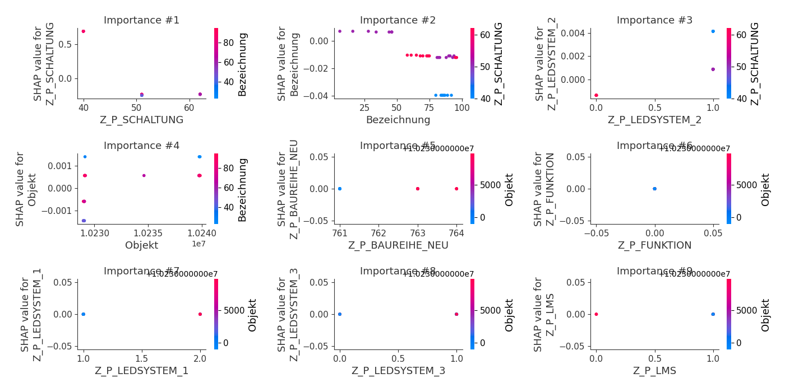
### Dependence 60000027-01 XPE 1ETDD (Fold 1)
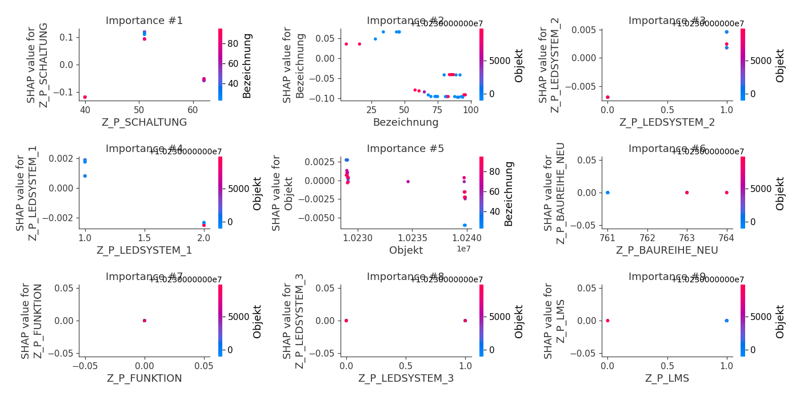
### Dependence 60000031-01 XPE 1ETDD-DT8 (Fold 1)
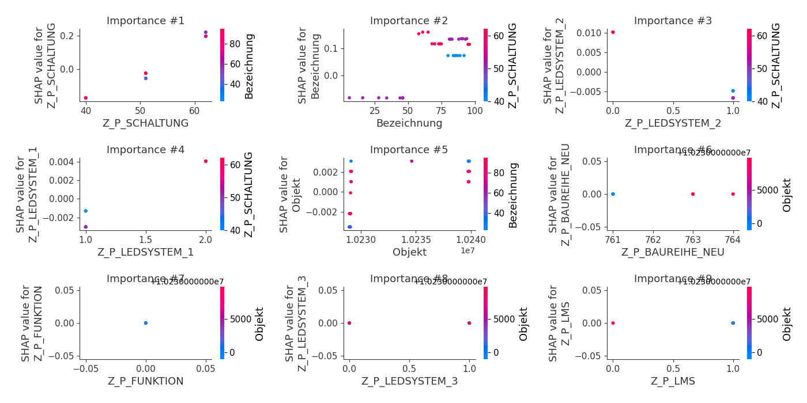
### Dependence 60000032-01 XPE 1ETDD-DT8 XPE (Fold 1)
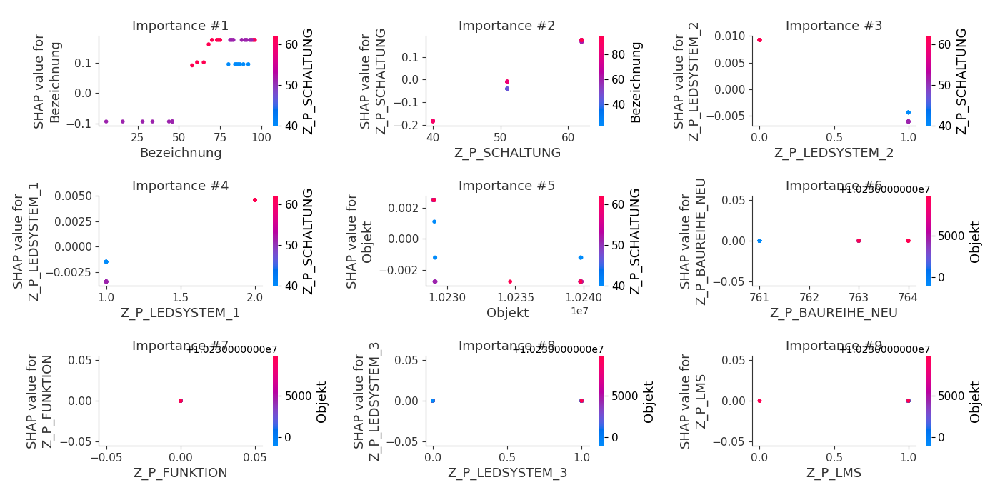
### Dependence 60000035-01 XPE 1ETDD-LiveLink (Fold 1)
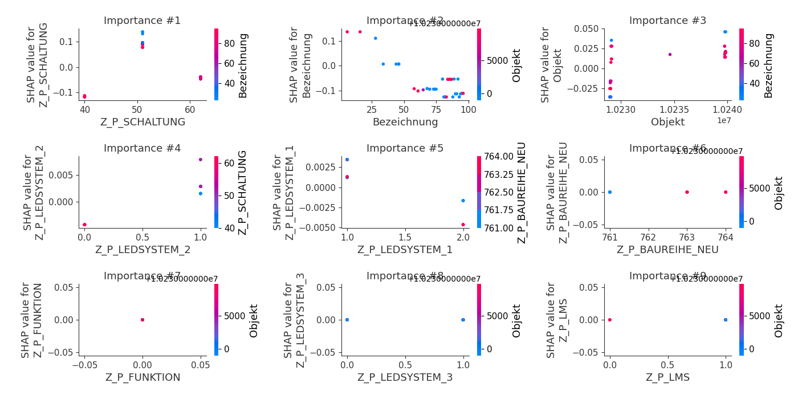
### Dependence 60000289-01 XPE 1ETDD-LiLi XPE (Fold 1)
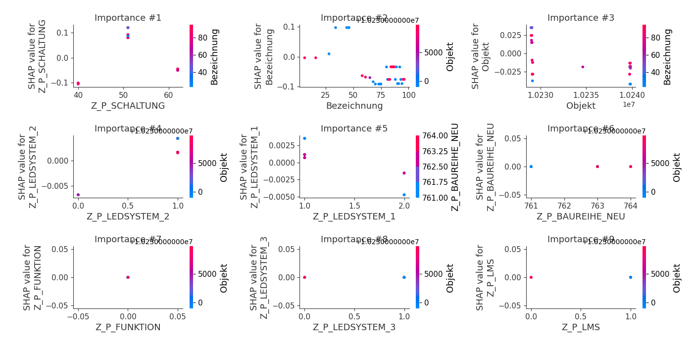

## SHAP Decision plots

### Worst decisions for selected sample 1 (Fold 1)

### Worst decisions for selected sample 2 (Fold 1)
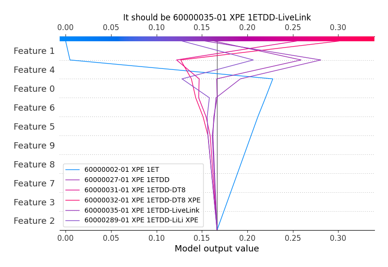
### Worst decisions for selected sample 3 (Fold 1)

### Worst decisions for selected sample 4 (Fold 1)

### Best decisions for selected sample 1 (Fold 1)
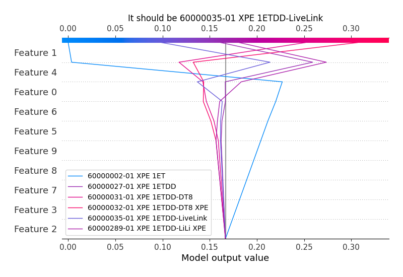
### Best decisions for selected sample 2 (Fold 1)

### Best decisions for selected sample 3 (Fold 1)

### Best decisions for selected sample 4 (Fold 1)
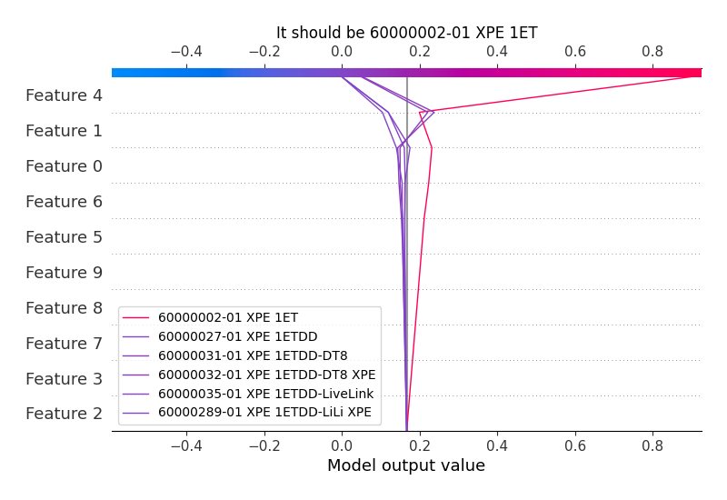

[<< Go back](../README.md)
