# Exploratory Data Analysis

[<< Go back](../README.md)
## Feature : target
- **Feature type** : categorical
- **Missing** : 0.0%
- **Unique** : 6
- **Count** :98
- **Unique** :6
- **Top** :60000002-01 XPE 1ET
- **Freq** :30

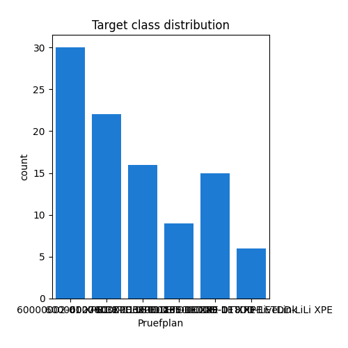
## Feature : Objekt
- **Feature type** : continous
- **Missing** : 0.0%
- **Unique** : 97
- **Count** :98.0
- **Mean** :10641052.0
- **Std** :4042379.835703519
- **Min** :10226106.0
- **25%th Percentile** : 10229029.75
- **50%th Percentile** : 10229113.0
- **75%th Percentile** : 10239773.0
- **Max** :50250196.0

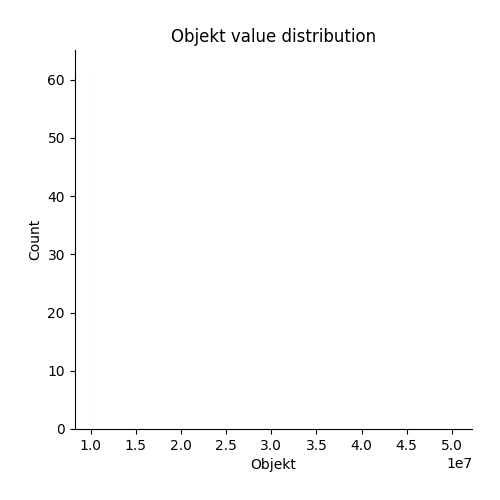
## Feature : Bezeichnung
- **Feature type** : categorical
- **Missing** : 0.0%
- **Unique** : 97
- **Count** :98
- **Unique** :97
- **Top** :Creavo M39 LW19-03 53-840 ETDD X3 01
- **Freq** :2

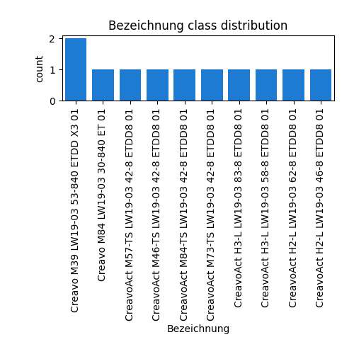
## Feature : Z_P_FAMILIE_NEU
- **Feature type** : continous
- **Missing** : 0.0%
- **Unique** : 1
- **Count** :98.0
- **Mean** :444.0
- **Std** :0.0
- **Min** :444.0
- **25%th Percentile** : 444.0
- **50%th Percentile** : 444.0
- **75%th Percentile** : 444.0
- **Max** :444.0

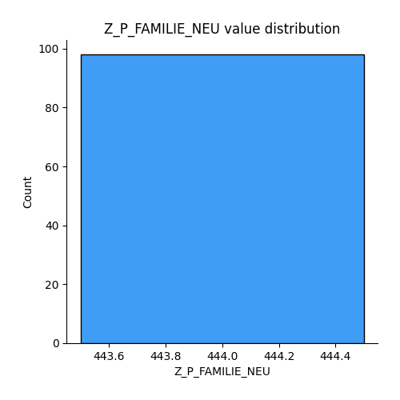
## Feature : Z_P_BAUREIHE_NEU
- **Feature type** : continous
- **Missing** : 0.0%
- **Unique** : 3
- **Count** :98.0
- **Mean** :761.9489795918367
- **Std** :1.2130939313083515
- **Min** :761.0
- **25%th Percentile** : 761.0
- **50%th Percentile** : 761.0
- **75%th Percentile** : 763.0
- **Max** :764.0

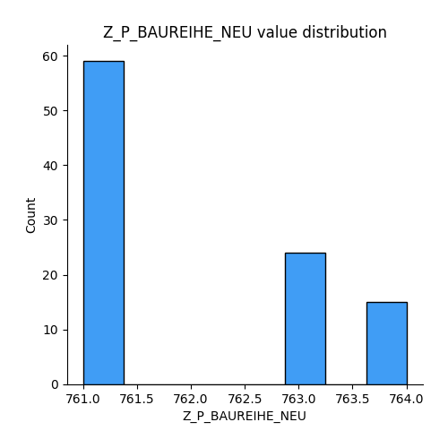
## Feature : Z_P_FUNKTION
- **Feature type** : categorical
- **Missing** : 77.55102040816327%
- **Unique** : 2
- **Count** :22
- **Unique** :2
- **Top** :07
- **Freq** :17

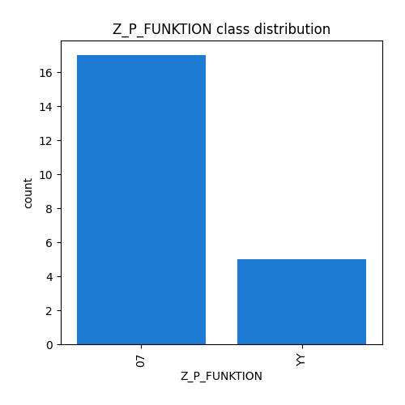
## Feature : CH000694
- **Feature type** : continous
- **Missing** : 100.0%
- **Unique** : 0
- **Count** :0.0
- **Mean** :nan
- **Std** :nan
- **Min** :nan
- **25%th Percentile** : nan
- **50%th Percentile** : nan
- **75%th Percentile** : nan
- **Max** :nan

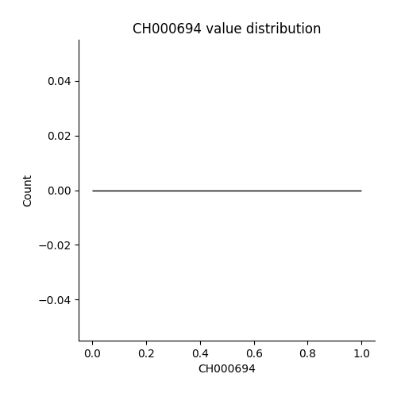
## Feature : Z_P_SCHALTUNG
- **Feature type** : continous
- **Missing** : 0.0%
- **Unique** : 3
- **Count** :98.0
- **Mean** :50.43877551020408
- **Std** :8.263778031333286
- **Min** :40.0
- **25%th Percentile** : 40.0
- **50%th Percentile** : 51.0
- **75%th Percentile** : 59.25
- **Max** :62.0

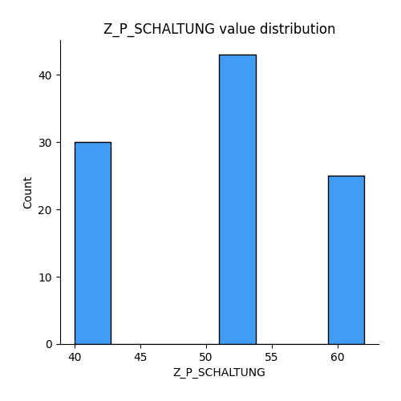
## Feature : Z_P_LEDSYSTEM_1
- **Feature type** : continous
- **Missing** : 7.142857142857143%
- **Unique** : 2
- **Count** :91.0
- **Mean** :1.2527472527472527
- **Std** :0.43699495530794286
- **Min** :1.0
- **25%th Percentile** : 1.0
- **50%th Percentile** : 1.0
- **75%th Percentile** : 1.5
- **Max** :2.0

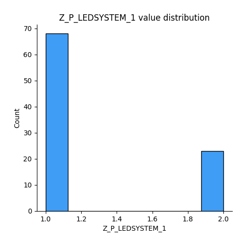
## Feature : Z_P_LEDSYSTEM_2
- **Feature type** : categorical
- **Missing** : 7.142857142857143%
- **Unique** : 2
- **Count** :91
- **Unique** :2
- **Top** :YY
- **Freq** :68

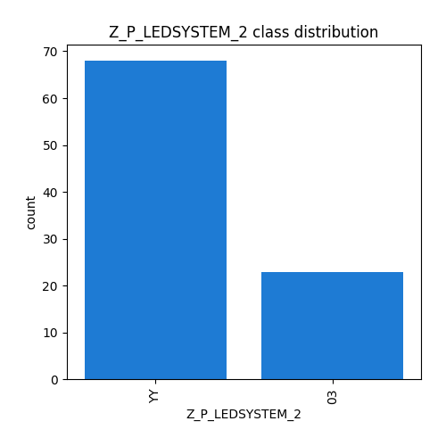
## Feature : Z_P_LEDSYSTEM_3
- **Feature type** : categorical
- **Missing** : 7.142857142857143%
- **Unique** : 2
- **Count** :91
- **Unique** :2
- **Top** :YY
- **Freq** :68

## Feature : Z_P_ANZ_STROMKR
- **Feature type** : continous
- **Missing** : 7.142857142857143%
- **Unique** : 1
- **Count** :91.0
- **Mean** :1.0
- **Std** :0.0
- **Min** :1.0
- **25%th Percentile** : 1.0
- **50%th Percentile** : 1.0
- **75%th Percentile** : 1.0
- **Max** :1.0

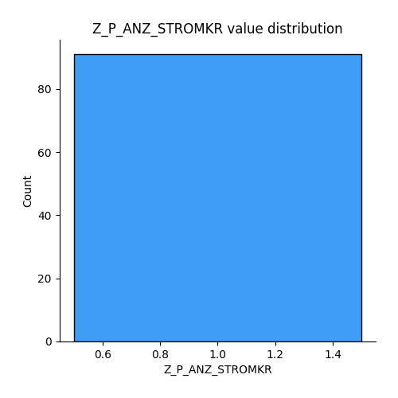
## Feature : Z_P_LMS
- **Feature type** : categorical
- **Missing** : 28.571428571428573%
- **Unique** : 2
- **Count** :70
- **Unique** :2
- **Top** :YY
- **Freq** :64

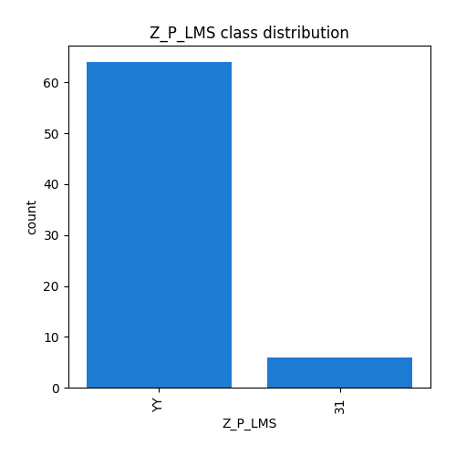
## Feature : Z_P_USA
- **Feature type** : continous
- **Missing** : 100.0%
- **Unique** : 0
- **Count** :0.0
- **Mean** :nan
- **Std** :nan
- **Min** :nan
- **25%th Percentile** : nan
- **50%th Percentile** : nan
- **75%th Percentile** : nan
- **Max** :nan

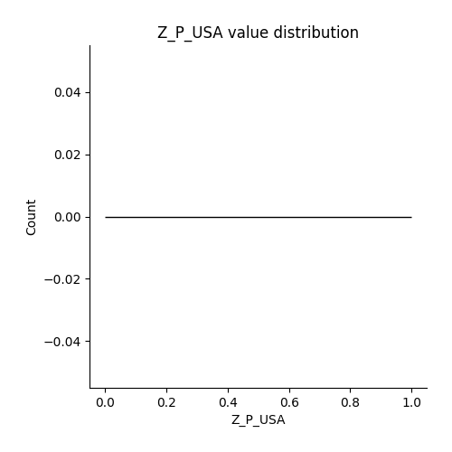
## Feature : Z_P_SCHUTZKLASSE
- **Feature type** : continous
- **Missing** : 7.142857142857143%
- **Unique** : 2
- **Count** :91.0
- **Mean** :1.054945054945055
- **Std** :0.22913544575873138
- **Min** :1.0
- **25%th Percentile** : 1.0
- **50%th Percentile** : 1.0
- **75%th Percentile** : 1.0
- **Max** :2.0

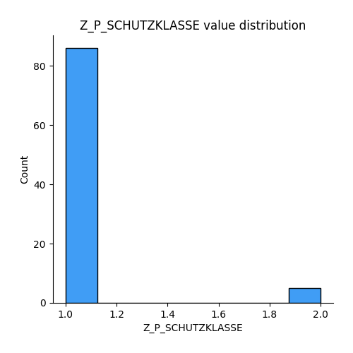
## Feature : Z_P_ELEKTRISCHE_SPANNUNG_DC
- **Feature type** : continous
- **Missing** : 100.0%
- **Unique** : 0
- **Count** :0.0
- **Mean** :nan
- **Std** :nan
- **Min** :nan
- **25%th Percentile** : nan
- **50%th Percentile** : nan
- **75%th Percentile** : nan
- **Max** :nan

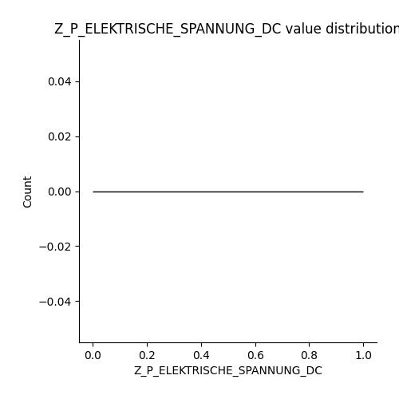
## Feature : Z_P_LEISTUNGSREDUZIERER
- **Feature type** : categorical
- **Missing** : 7.142857142857143%
- **Unique** : 1
- **Count** :91
- **Unique** :1
- **Top** :NE
- **Freq** :91

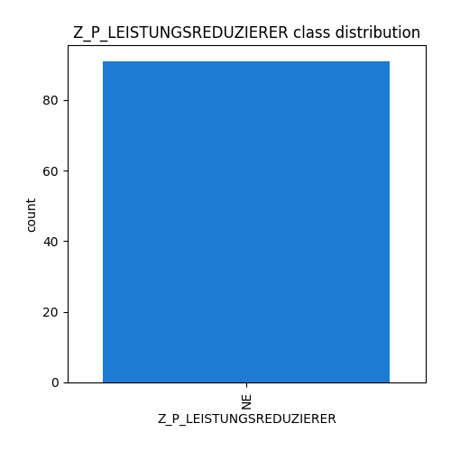
## Feature : Z_P_BEMESSUNGSSPANNUNG
- **Feature type** : categorical
- **Missing** : 33.673469387755105%
- **Unique** : 1
- **Count** :65
- **Unique** :1
- **Top** :220 - 240 V
- **Freq** :65

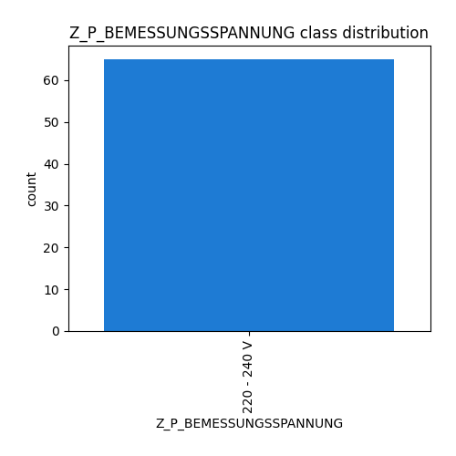
## Feature : Z_P_BEMESSUNGSFREQUENZ
- **Feature type** : continous
- **Missing** : 7.142857142857143%
- **Unique** : 1
- **Count** :91.0
- **Mean** :4.0
- **Std** :0.0
- **Min** :4.0
- **25%th Percentile** : 4.0
- **50%th Percentile** : 4.0
- **75%th Percentile** : 4.0
- **Max** :4.0

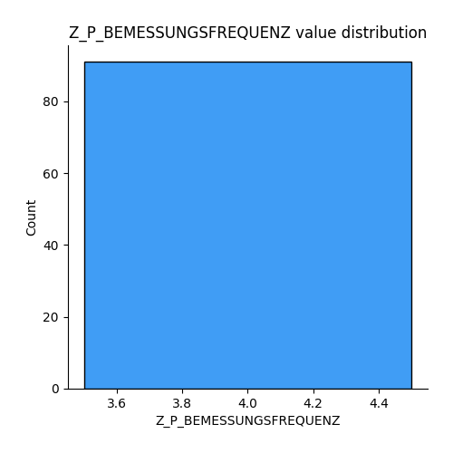
## Feature : Z_P_LEISTUNGSR_PROZENT
- **Feature type** : continous
- **Missing** : 100.0%
- **Unique** : 0
- **Count** :0.0
- **Mean** :nan
- **Std** :nan
- **Min** :nan
- **25%th Percentile** : nan
- **50%th Percentile** : nan
- **75%th Percentile** : nan
- **Max** :nan

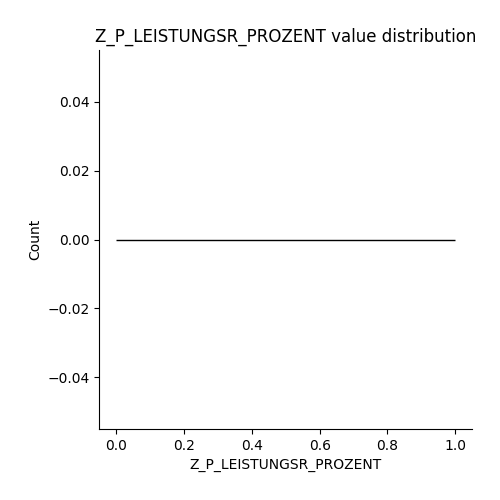
## Feature : Z_P_ALZ_SCHALTER
- **Feature type** : categorical
- **Missing** : 0.0%
- **Unique** : 1
- **Count** :98
- **Unique** :1
- **Top** :YY
- **Freq** :98

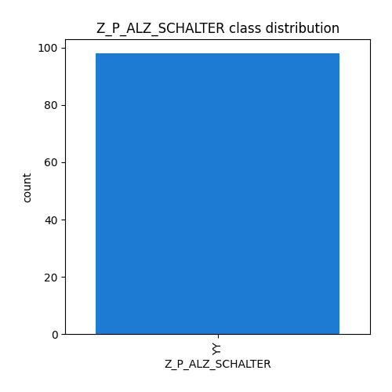

[<< Go back](../README.md)
