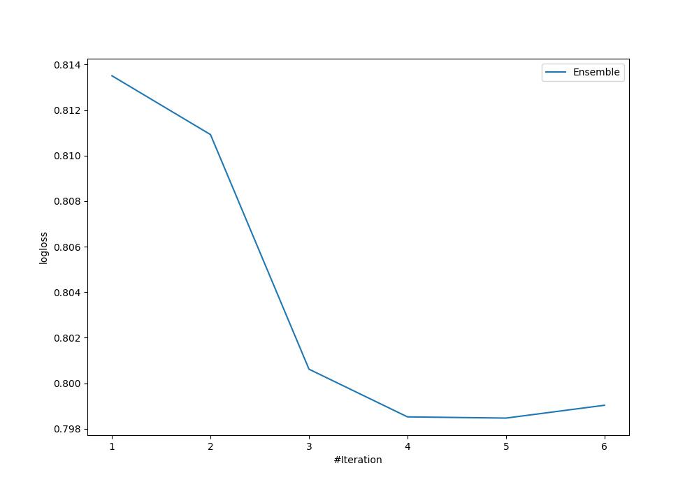
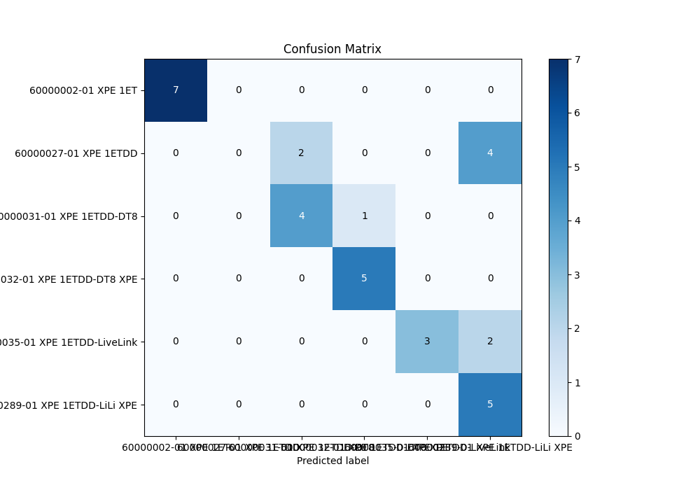
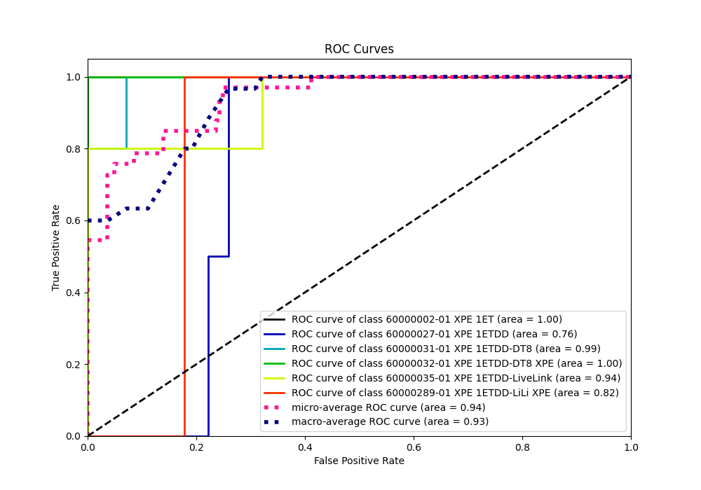
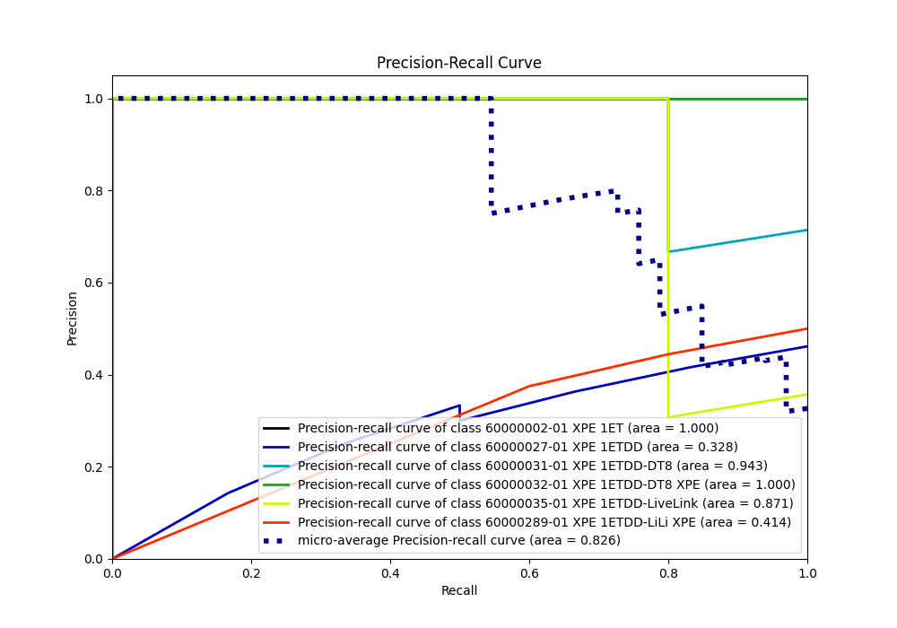

# Summary of Ensemble

[<< Go back](../README.md)

## Ensemble structure
| Model                  |   Weight |
|:-----------------------|---------:|
| 3_Linear               |        4 |
| 6_Default_RandomForest |        1 |

### Metric details
|           |   60000002-01 XPE 1ET |   60000027-01 XPE 1ETDD |   60000031-01 XPE 1ETDD-DT8 |   60000032-01 XPE 1ETDD-DT8 XPE |   60000035-01 XPE 1ETDD-LiveLink |   60000289-01 XPE 1ETDD-LiLi XPE |   accuracy |   macro avg |   weighted avg |   logloss |
|:----------|----------------------:|------------------------:|----------------------------:|--------------------------------:|---------------------------------:|---------------------------------:|-----------:|------------:|---------------:|----------:|
| precision |                     1 |                       0 |                    0.666667 |                        0.833333 |                             1    |                         0.454545 |   0.727273 |    0.659091 |       0.65978  |  0.798472 |
| recall    |                     1 |                       0 |                    0.8      |                        1        |                             0.6  |                         1        |   0.727273 |    0.733333 |       0.727273 |  0.798472 |
| f1-score  |                     1 |                       0 |                    0.727273 |                        0.909091 |                             0.75 |                         0.625    |   0.727273 |    0.668561 |       0.668388 |  0.798472 |
| support   |                     7 |                       6 |                    5        |                        5        |                             5    |                         5        |   0.727273 |   33        |      33        |  0.798472 |

## Confusion matrix
|                                           |   Predicted as 60000002-01 XPE 1ET |   Predicted as 60000027-01 XPE 1ETDD |   Predicted as 60000031-01 XPE 1ETDD-DT8 |   Predicted as 60000032-01 XPE 1ETDD-DT8 XPE |   Predicted as 60000035-01 XPE 1ETDD-LiveLink |   Predicted as 60000289-01 XPE 1ETDD-LiLi XPE |
|:------------------------------------------|-----------------------------------:|-------------------------------------:|-----------------------------------------:|---------------------------------------------:|----------------------------------------------:|----------------------------------------------:|
| Labeled as 60000002-01 XPE 1ET            |                                  7 |                                    0 |                                        0 |                                            0 |                                             0 |                                             0 |
| Labeled as 60000027-01 XPE 1ETDD          |                                  0 |                                    0 |                                        2 |                                            0 |                                             0 |                                             4 |
| Labeled as 60000031-01 XPE 1ETDD-DT8      |                                  0 |                                    0 |                                        4 |                                            1 |                                             0 |                                             0 |
| Labeled as 60000032-01 XPE 1ETDD-DT8 XPE  |                                  0 |                                    0 |                                        0 |                                            5 |                                             0 |                                             0 |
| Labeled as 60000035-01 XPE 1ETDD-LiveLink |                                  0 |                                    0 |                                        0 |                                            0 |                                             3 |                                             2 |
| Labeled as 60000289-01 XPE 1ETDD-LiLi XPE |                                  0 |                                    0 |                                        0 |                                            0 |                                             0 |                                             5 |

## Learning curves

## Confusion Matrix

## Normalized Confusion Matrix

## ROC Curve

## Precision Recall Curve

[<< Go back](../README.md)
