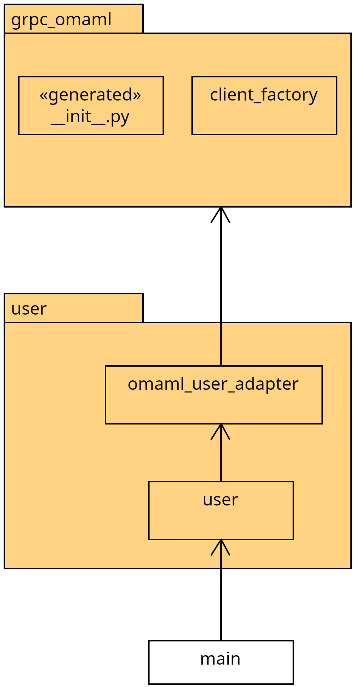

# Architecture of the benchmark tool

This document explains the architecture of the benchmark tool. It is a living document, which means that a: it explains the state of the program as it is, not how it is supposed to be in the future and b: it has to be updated every time defining decisions are made.

## Introduction & Goals

See the folder [README](../README.md).

## Constraints

1. Technology choices should match technologies already used in OMAML (C# or python, gRPC)
2. No user interaction (The option of running the benchmark tool as a part of the cluster should be held open)

## Context & Scope

## Solution Strategy

1. Python is used (defined by project lead).
2. Autoformatting and linting in the project to not have to worry about code style as much.
3. OMAML is treated as an external dependency.
4. External dependencies are encapsulated and only accessed through adapters (Dependency Inversion Principle). This allows changes in external dependencies with minimal code adaptions.
5. The existing gRPC interface of the controller is used to communicate with OMAML.

## Building Block View

### Interaction with OMAML

The following diagram shows how OMAML is kept at the edge of the program on the example of the user initialization. The omaml_user_adapter defines how the benchmark wants to use the target system and takes care to translate this desired interface to the actual grpc interface.

<!--
## Runtime View
(May contain information about runtime behaviour (e.g. order of events))
-->
## Deployment View

The benchmark tool is a console program that is not part of the regular deployment of OMAML. It is expected that the tool is always executed manually. The option of running it inside the production cluster should remain available though.

<!--
## Architectural Decisions

## Quality Requirements
-->

## Risks & Technical Debt

### Risks

- If the benchmark should run against the production cluster eventually then the gRPC interface must be reachable. That would require authentication however.
- The user component creates a new user in OMAML, if no guid was passed in configuration. This user is not visible in the OMAML frontend though. Technically that is fine, because the OMAML UI is not actually needed, but when run against a production system, this is probably undesired.

### Technical Debt

- None (so far)

## Glossary

1. Controller: The python backend of OMAML
2. AutoMl: Tools like autosklearn, autokeras, etc.
3. AutoMlAdapter: The services that the controller calls to start operations on AutoMls
4. Adapter: A class implementing the adapter pattern
