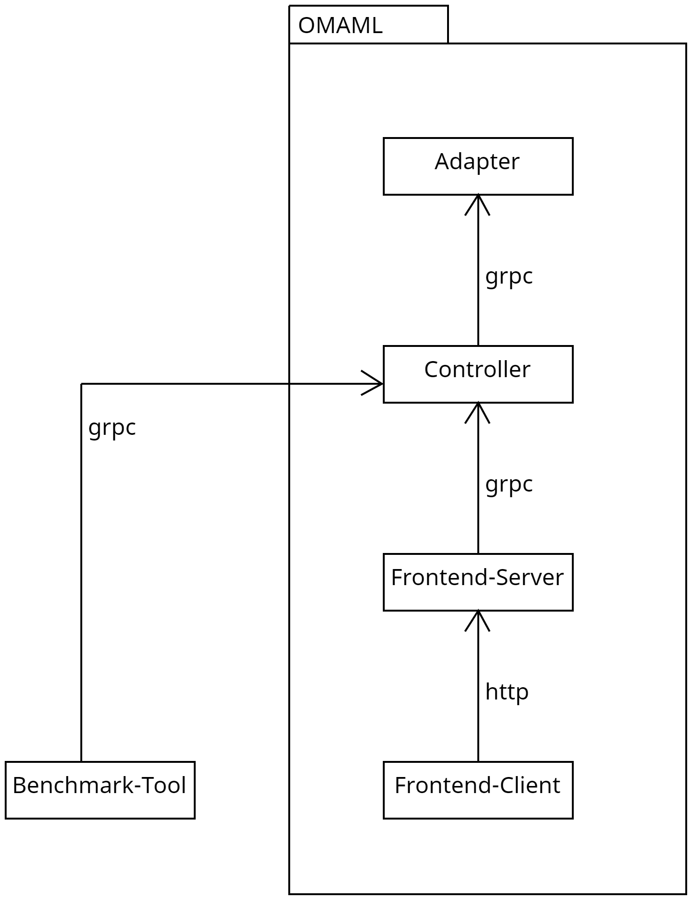

# Architecture of the benchmark tool

## Introduction & Goals

See the folder [README](../README.md).

## Constraints

1. Technology choices should match technologies already used in OMAML (C# or python, gRPC)

## Context & Scope

## Solution Strategy

1. Python is used (defined by project lead)
2. Autoformatting and linting in the project to not have to worry about code style as much
3. OMAML is treated as an external dependency.
4. External dependencies are encapsulated and only accessed through adapters (Dependency Inversion Principle). This allows changes in external dependencies with minimal code adaptions.
5. The existing gRPC interface of the controller is used to communicate with OMAML

## Building Block View

## Runtime View

## Deployment View

## Architectural Decisions

## Quality Requirements

## Risks & Technical Debt

### Risks

- If the benchmark should run against the production cluster eventually then the gRPC interface must be reachable. That would require authentication however.

### Technical Debt

- None (so far)

## Glossary

1. Controller: The python backend of OMAML
2. AutoMl: Tools like autosklearn, autokeras, etc.
3. AutoMlAdapter: The services that the controller calls to start operations on AutoMls
4. Adapter: A class implementing the adapter pattern
